# FRW Monorepo Architecture Documentation

## Overview

Flow Reference Wallet (FRW) adopts a monorepo architecture using pnpm workspaces
to manage multiple packages. The overall architecture is based on layered design
and the ServiceContext pattern, achieving clear separation of responsibilities
and dependency management.

## Architecture Diagram

```mermaid
graph TB
    subgraph "Applications Layer"
        RN[React Native App]
        EXT[Browser Extension]
    end

    subgraph "Business Logic Layer"
        STORES[📦 stores<br/>State Management]
        WORKFLOW[📦 workflow<br/>Transaction Logic]
    end

    subgraph "Service Layer"
        SERVICES[📦 services<br/>Business Services]
    end

    subgraph "Core Layer"
        CADENCE[📦 cadence<br/>Flow Integration]
        API[📦 api<br/>Network Layer]
    end

    subgraph "Foundation Layer"
        CONTEXT[📦 context<br/>DI Container & Interfaces]
        TYPES[📦 types<br/>Type Definitions]
        UTILS[📦 utils<br/>Utilities]
    end

    subgraph "Platform Bridge"
        BRIDGE[Bridge Layer<br/>Native Integration]
    end

    %% Dependencies
    RN --> STORES
    RN --> WORKFLOW
    RN --> SERVICES
    RN --> BRIDGE

    EXT --> STORES
    EXT --> WORKFLOW
    EXT --> SERVICES

    STORES --> SERVICES
    WORKFLOW --> CADENCE
    WORKFLOW --> SERVICES

    SERVICES --> CONTEXT
    SERVICES --> API
    SERVICES --> CADENCE

    CADENCE --> TYPES
    API --> TYPES
    SERVICES --> TYPES
    STORES --> TYPES
    WORKFLOW --> TYPES

    SERVICES --> UTILS
    STORES --> UTILS

    CONTEXT --> CADENCE
    CONTEXT --> WORKFLOW
    CONTEXT -.-> BRIDGE

    %% Styling
    classDef appLayer fill:#e1f5fe
    classDef businessLayer fill:#f3e5f5
    classDef serviceLayer fill:#e8f5e8
    classDef coreLayer fill:#fff3e0
    classDef foundationLayer fill:#fafafa
    classDef bridgeLayer fill:#ffebee

    class RN,EXT appLayer
    class STORES,WORKFLOW businessLayer
    class SERVICES serviceLayer
    class CADENCE,API coreLayer
    class CONTEXT,TYPES,UTILS foundationLayer
    class BRIDGE bridgeLayer
```



## Package Architecture

### 📱 Applications Layer

#### React Native App (`apps/react-native`)

- **Responsibility**: Mobile app entry point, UI rendering, user interaction
- **Tech Stack**: React Native, React Navigation, NativeWind
- **Key Features**:
  - Theme system (Light/Dark mode)
  - Native Bridge integration
  - Service initialization and dependency injection

```typescript
// App.tsx - Service initialization
import { ServiceContext } from '@onflow/frw-context';
import { bridge } from './bridge/RNBridge';

useEffect(() => {
  // Initialize ServiceContext for dependency injection
  ServiceContext.initialize(bridge);
}, []);
```

#### Browser Extension (`apps/extension`)

- **Responsibility**: Browser extension entry point
- **Status**: Reserved for future extension

---

### 🧠 Business Logic Layer

#### 📦 Stores Package (`packages/stores`)

- **Responsibility**: Global state management, caching strategies
- **Tech Stack**: Zustand
- **Core Modules**:
  - `walletStore`: Wallet account management
  - `tokenStore`: Token and NFT data caching
  - `sendStore`: Transfer flow state management

```javascript
// Accessing services through ServiceContext
import { getCadenceService } from '@onflow/frw-context';
import { getFlowService } from '@onflow/frw-services';

const cadenceService = getCadenceService();
const flowService = getFlowService();
```

#### 📦 Workflow Package (`packages/workflow`)

- **Responsibility**: Transaction logic, transfer strategy pattern
- **Design Pattern**: Strategy Pattern
- **Core Features**:
  - Multiple transfer strategies (Flow-to-Flow, EVM-to-EVM, cross-chain
    transfers, etc.)
  - Bridge authentication integration
  - FCL configuration management

```javascript
// Bridge authentication integration
export function createCadenceService(network, bridge) {
  const service = new CadenceService();

  if (bridge) {
    // Inject authentication interceptors
    service.useRequestInterceptor(async (config) => {
      if (config.type === 'transaction') {
        config.payer = await bridge.getPayer();
        config.proposer = await bridge.getProposer();
        config.authorizations = await bridge.getAuthorizations();
      }
      return config;
    });
  }

  return service;
}
```

---

### 🔧 Service Layer

#### 📦 Services Package (`packages/services`)

- **Responsibility**: Business service encapsulation
- **Core Modules**:
  - `FlowService`: Flow blockchain interaction
  - `TokenService` / `NFTService`: Asset data services
  - `AddressBookService`: Address book management
- **Dependencies**: Uses ServiceContext from `@onflow/frw-context` for DI

---

### ⚡ Core Layer

#### 📦 Cadence Package (`packages/cadence`)

- **Responsibility**: Flow blockchain low-level interaction
- **Tech Stack**: @onflow/fcl
- **Core Features**:
  - Cadence script execution
  - Transaction building and signing
  - Request/response interceptor system

#### 📦 API Package (`packages/api`)

- **Responsibility**: HTTP API calls, external service integration
- **Tech Stack**: Axios, OpenAPI code generation
- **Services**:
  - Flow API services
  - Third-party data services

---

### 🏗️ Foundation Layer

#### 📦 Context Package (`packages/context`)

- **Responsibility**: Dependency injection container and core interfaces
- **Tech Stack**: TypeScript
- **Core Features**:
  - `ServiceContext`: Singleton dependency injection container
  - `BridgeSpec`: Platform abstraction interface
  - Service initialization and lifecycle management

##### ServiceContext Pattern

```typescript
// packages/context/src/ServiceContext.ts
export class ServiceContext {
  private static instance: ServiceContext | null = null;
  private _bridge: BridgeSpec | null = null;
  private _cadenceService: CadenceService | null = null;

  public static initialize(bridge: BridgeSpec): ServiceContext {
    if (!ServiceContext.instance) {
      ServiceContext.instance = new ServiceContext();
    }
    ServiceContext.instance._bridge = bridge;

    // Create authenticated CadenceService
    const network = bridge.getNetwork() as 'mainnet' | 'testnet';
    ServiceContext.instance._cadenceService = createCadenceService(
      network,
      bridge
    );

    return ServiceContext.instance;
  }

  // Getter methods provide service access
  get cadence(): CadenceService {
    return this._cadenceService!;
  }
  get bridge(): BridgeSpec {
    return this._bridge!;
  }
}

// Convenience functions
export const getCadenceService = () => getServiceContext().cadence;
export const getServiceContext = () => ServiceContext.getInstance();
```

##### Bridge Specification

```typescript
// packages/context/src/interfaces/BridgeSpec.ts
export interface BridgeSpec {
  // Basic platform methods
  getSelectedAddress(): string | null;
  getNetwork(): string;
  getJWT(): Promise<string>;
  getVersion(): string;
  getBuildNumber(): string;
  sign(hexData: string): Promise<string>;
  getSignKeyIndex(): number;

  // Data access methods
  getRecentContacts(): Promise<RecentContactsResponse>;
  getWalletAccounts(): Promise<WalletAccountsResponse>;

  // Flow transaction authentication methods
  getProposer(): Promise<any>;
  getPayer(): Promise<any>;
  getAuthorizations(): Promise<any[]>;

  // UI interaction methods
  scanQRCode(): Promise<string>;
  closeRN(): void;
}
```

#### 📦 Types Package (`packages/types`)

- **Responsibility**: TypeScript type definitions
- **Core Types**:
  - `WalletAccount`, `TokenInfo`, `NFTModel`
  - `BridgeSpec`, `SendPayload`
  - Business domain models

#### 📦 Utils Package (`packages/utils`)

- **Responsibility**: Pure function utility library
- **Features**:
  - Address formatting and validation
  - NFT data processing
  - String and numeric utilities

---

## React Native App Layer Architecture

### 🏗️ MVVM Architecture Pattern

The React Native application follows the **Model-View-ViewModel (MVVM)** pattern
to ensure clear separation of concerns, testability, and maintainability.

```mermaid
graph TD
    subgraph "View Layer"
        V[📱 React Components<br/>- Screens<br/>- UI Components]
        NAV[🧭 Navigation<br/>- AppNavigator<br/>- Route Handlers]
    end

    subgraph "ViewModel Layer"
        VM[🔧 ViewModels<br/>- Business Logic<br/>- State Management<br/>- User Interactions]
        HOOKS[🪝 Custom Hooks<br/>- Data Fetching<br/>- Side Effects]
        CTX[⚛️ React Contexts<br/>- Global State<br/>- Theme Management]
    end

    subgraph "Model Layer"
        STORES[📊 Zustand Stores<br/>- Data Persistence<br/>- Cache Management]
        SERVICES[⚙️ Business Services<br/>- API Calls<br/>- Business Logic]
        BRIDGE[🌉 Platform Bridge<br/>- Native Integration<br/>- Device APIs]
    end

    subgraph "Data Layer"
        FLOW[🌊 Flow Network<br/>- Blockchain Data<br/>- Transactions]
        API[📡 External APIs<br/>- Third-party Services<br/>- RESTful APIs]
    end

    %% Dependencies
    V --> VM
    NAV --> VM
    VM --> HOOKS
    VM --> CTX
    VM --> STORES
    HOOKS --> SERVICES
    HOOKS --> BRIDGE
    STORES --> SERVICES
    SERVICES --> FLOW
    SERVICES --> API
    BRIDGE --> FLOW

    %% Styling
    classDef viewLayer fill:#e3f2fd
    classDef viewModelLayer fill:#f3e5f5
    classDef modelLayer fill:#e8f5e8
    classDef dataLayer fill:#fff3e0

    class V,NAV viewLayer
    class VM,HOOKS,CTX viewModelLayer
    class STORES,SERVICES,BRIDGE modelLayer
    class FLOW,API dataLayer
```



### 🏗️ Directory Structure

```
apps/react-native/
├── src/
│   ├── components/          # 📱 View Layer
│   │   ├── ui/             # Reusable UI components
│   │   ├── screens/        # Screen components
│   │   └── common/         # Shared components
│   ├── viewmodels/         # 🔧 ViewModel Layer (NEW)
│   │   ├── hooks/          # Custom hooks for business logic
│   │   ├── contexts/       # React Context providers
│   │   └── stores/         # Screen-specific state
│   ├── models/             # 📊 Model Layer (NEW)
│   │   ├── entities/       # Data entities/types
│   │   ├── repositories/   # Data access abstractions
│   │   └── services/       # Business service interfaces
│   ├── navigation/         # 🧭 Navigation Layer
│   │   └── AppNavigator    # React Navigation config
│   ├── bridge/            # 🌉 Platform Bridge Layer
│   │   ├── RNBridge       # React Native Bridge implementation
│   │   └── NativeFRWBridge # Native module interface
│   └── lib/               # 🛠️ Utilities
│       ├── i18n           # Internationalization
│       └── utils          # Helper functions
```

### 🔄 MVVM Data Flow


### 🔧 MVVM Implementation Examples

#### View Component (React Component)

```typescript
// src/components/screens/SendTokenScreen.tsx
import React from 'react';
import { View, Text, Button } from 'react-native';
import { useSendTokenViewModel } from '../../viewmodels/hooks/useSendTokenViewModel';

export const SendTokenScreen: React.FC = () => {
  // ViewModel provides all business logic and state
  const {
    recipient,
    amount,
    isLoading,
    error,
    setRecipient,
    setAmount,
    sendToken,
    validateInput
  } = useSendTokenViewModel();

  return (
    <View>
      <Text>Send Token</Text>

      {/* View only handles presentation and user events */}
      <TextInput
        value={recipient}
        onChangeText={setRecipient}
        placeholder="Recipient Address"
        style={validateInput.recipient ? styles.valid : styles.invalid}
      />

      <TextInput
        value={amount}
        onChangeText={setAmount}
        placeholder="Amount"
        style={validateInput.amount ? styles.valid : styles.invalid}
      />

      {error && <Text style={styles.error}>{error}</Text>}

      <Button
        title={isLoading ? "Sending..." : "Send"}
        onPress={sendToken}
        disabled={isLoading || !validateInput.isValid}
      />
    </View>
  );
};
```

#### ViewModel (Custom Hook)

```typescript
// src/viewmodels/hooks/useSendTokenViewModel.ts
import { useState, useEffect, useCallback } from 'react';
import { useSendTokenStore } from '../stores/sendTokenStore';
import { useWalletStore } from '@onflow/frw-stores';
import { getFlowService } from '@onflow/frw-services';
import { logger } from '@onflow/frw-utils';

export const useSendTokenViewModel = () => {
  // Local UI state
  const [recipient, setRecipient] = useState('');
  const [amount, setAmount] = useState('');
  const [isLoading, setIsLoading] = useState(false);
  const [error, setError] = useState<string | null>(null);

  // Global state from stores
  const { transactions, addTransaction } = useSendTokenStore();
  const { currentAccount, balance } = useWalletStore();

  // Business logic validation
  const validateInput = useMemo(() => {
    const isValidRecipient =
      recipient.length > 0 && /^0x[0-9a-fA-F]{16}$/.test(recipient);
    const isValidAmount =
      parseFloat(amount) > 0 && parseFloat(amount) <= balance;

    return {
      recipient: isValidRecipient,
      amount: isValidAmount,
      isValid: isValidRecipient && isValidAmount,
    };
  }, [recipient, amount, balance]);

  // Business logic - Send token transaction
  const sendToken = useCallback(async () => {
    if (!validateInput.isValid || !currentAccount) {
      setError('Invalid input or no account selected');
      return;
    }

    try {
      setIsLoading(true);
      setError(null);

      // Use service layer for business logic
      const flowService = getFlowService();
      const txResult = await flowService.sendFlow({
        to: recipient,
        amount: parseFloat(amount),
        from: currentAccount.address,
      });

      // Update model layer
      addTransaction({
        id: txResult.transactionId,
        to: recipient,
        amount: parseFloat(amount),
        status: 'pending',
        timestamp: Date.now(),
      });

      logger.info('Token sent successfully', { txId: txResult.transactionId });

      // Reset form
      setRecipient('');
      setAmount('');
    } catch (err) {
      const errorMessage =
        err instanceof Error ? err.message : 'Transaction failed';
      setError(errorMessage);
      logger.error('Send token failed', { error: errorMessage });
    } finally {
      setIsLoading(false);
    }
  }, [
    recipient,
    amount,
    currentAccount,
    validateInput.isValid,
    addTransaction,
  ]);

  // Return ViewModel interface to View
  return {
    // State
    recipient,
    amount,
    isLoading,
    error,
    validateInput,

    // Actions
    setRecipient,
    setAmount,
    sendToken,

    // Computed values
    transactions,
    canSend: validateInput.isValid && !isLoading,
  };
};
```

#### Model (Zustand Store)

```typescript
// src/viewmodels/stores/sendTokenStore.ts
import { create } from 'zustand';
import { persist } from 'zustand/middleware';
import { createJSONStorage } from 'zustand/middleware';
import { mmkvStorage } from '@onflow/frw-utils';

export interface Transaction {
  id: string;
  to: string;
  amount: number;
  status: 'pending' | 'success' | 'failed';
  timestamp: number;
}

interface SendTokenState {
  transactions: Transaction[];
  recentRecipients: string[];

  // Actions
  addTransaction: (tx: Transaction) => void;
  updateTransactionStatus: (id: string, status: Transaction['status']) => void;
  addRecentRecipient: (address: string) => void;
  clearTransactions: () => void;
}

export const useSendTokenStore = create<SendTokenState>()(
  persist(
    (set, get) => ({
      transactions: [],
      recentRecipients: [],

      addTransaction: (tx) =>
        set((state) => ({
          transactions: [tx, ...state.transactions.slice(0, 49)], // Keep last 50
        })),

      updateTransactionStatus: (id, status) =>
        set((state) => ({
          transactions: state.transactions.map((tx) =>
            tx.id === id ? { ...tx, status } : tx
          ),
        })),

      addRecentRecipient: (address) =>
        set((state) => ({
          recentRecipients: [
            address,
            ...state.recentRecipients
              .filter((addr) => addr !== address)
              .slice(0, 9),
          ], // Keep last 10 unique recipients
        })),

      clearTransactions: () => set({ transactions: [] }),
    }),
    {
      name: 'send-token-store',
      storage: createJSONStorage(() => mmkvStorage),
    }
  )
);
```

### 🧪 MVVM Testing Strategy

#### ViewModel Testing

```typescript
// src/viewmodels/hooks/__tests__/useSendTokenViewModel.test.ts
import { renderHook, act } from '@testing-library/react-hooks';
import { useSendTokenViewModel } from '../useSendTokenViewModel';

// Mock the stores and services
jest.mock('@onflow/frw-stores');
jest.mock('@onflow/frw-services');

describe('useSendTokenViewModel', () => {
  it('should validate recipient address correctly', () => {
    const { result } = renderHook(() => useSendTokenViewModel());

    act(() => {
      result.current.setRecipient('0x1234567890123456');
    });

    expect(result.current.validateInput.recipient).toBe(true);
  });

  it('should handle send token flow correctly', async () => {
    const mockSendFlow = jest
      .fn()
      .mockResolvedValue({ transactionId: 'tx123' });
    (getFlowService as jest.Mock).mockReturnValue({ sendFlow: mockSendFlow });

    const { result } = renderHook(() => useSendTokenViewModel());

    act(() => {
      result.current.setRecipient('0x1234567890123456');
      result.current.setAmount('10.5');
    });

    await act(async () => {
      await result.current.sendToken();
    });

    expect(mockSendFlow).toHaveBeenCalledWith({
      to: '0x1234567890123456',
      amount: 10.5,
      from: expect.any(String),
    });
  });
});
```

### 🔄 Data Flow


### 🔌 Bridge Integration

#### Native Bridge Architecture

```typescript
// apps/react-native/src/bridge/RNBridge.ts
class RNBridge implements BridgeSpec {
  getSelectedAddress(): string | null {
    return NativeFRWBridge.getSelectedAddress();
  }

  async getProposer(): Promise<any> {
    return await NativeFRWBridge.getProposer();
  }

  async getPayer(): Promise<any> {
    return await NativeFRWBridge.getPayer();
  }

  async getAuthorizations(): Promise<any[]> {
    return await NativeFRWBridge.getAuthorizations();
  }
}
```

#### Service Initialization Flow

```typescript
// App.tsx
import { ServiceContext } from '@onflow/frw-context';

const App = () => {
  useEffect(() => {
    const initializeApp = async () => {
      // 1. Initialize ServiceContext with bridge
      ServiceContext.initialize(bridge);

      // 2. Load wallet data
      await loadAccountsFromBridge();
    };

    initializeApp();
  }, []);
};
```

## Key Design Principles

### 🎯 Layer Responsibilities

1. **UI Layer**: Pure presentation logic, no business logic
2. **State Layer**: State management and caching strategies
3. **Service Layer**: Business logic encapsulation and API abstraction
4. **Core Layer**: Blockchain and network interaction
5. **Foundation Layer**: Type definitions and utility functions

### 🔄 Dependency Management

- **Upward Dependencies**: Lower layers don't depend on higher layers
- **Horizontal Isolation**: Minimal dependencies between same-layer packages
- **Interface Abstraction**: Decoupling through interfaces and ServiceContext

### 🚀 Extensibility

- **Adding Services**: Add new services in services package, access through
  ServiceContext from context package
- **Adding Applications**: Reuse all packages, only need to implement
  corresponding Bridge
- **Adding Features**: Extend through Strategy Pattern in workflow

## Development Workflow

### 🛠️ Development Commands

```bash
# Install dependencies
pnpm install

# Build all packages
pnpm run build

# Start React Native
cd apps/react-native
pnpm start

# Run tests
pnpm run test
```

### 📦 Package Development

1. **Modify Types**: Define in `packages/types`
2. **Add Utility Functions**: Implement in `packages/utils`
3. **Add Services**: Add in `packages/services`, access through ServiceContext
   from `packages/context`
4. **State Management**: Use Zustand in `packages/stores`
5. **Transaction Logic**: Use Strategy Pattern in `packages/workflow`

### 🧪 Testing Strategy

- **Unit Tests**: Each package tested independently
- **Integration Tests**: End-to-end tests in workflow package
- **Mock Bridge**: Test isolation through ServiceContext.reset()

---

## Benefits of This Architecture

### ✅ Advantages

1. **Clear Separation of Responsibilities**: Each package has a clear scope of
   responsibility
2. **High Reusability**: Packages can be reused across different applications
3. **Type Safety**: Complete TypeScript support
4. **Easy Testing**: ServiceContext pattern facilitates mocking and testing
5. **Platform Agnostic**: Bridge pattern supports multi-platform extension
6. **Maintainability**: Layered architecture is easy to understand and maintain

### 🎯 Use Cases

- Multi-platform wallet application development
- Blockchain applications requiring complex state management
- Large-scale projects with team collaboration
- Projects needing rapid new feature expansion

---

_This architecture documentation is maintained by the FRW development team. For
questions or suggestions, please create an issue in the repository._
