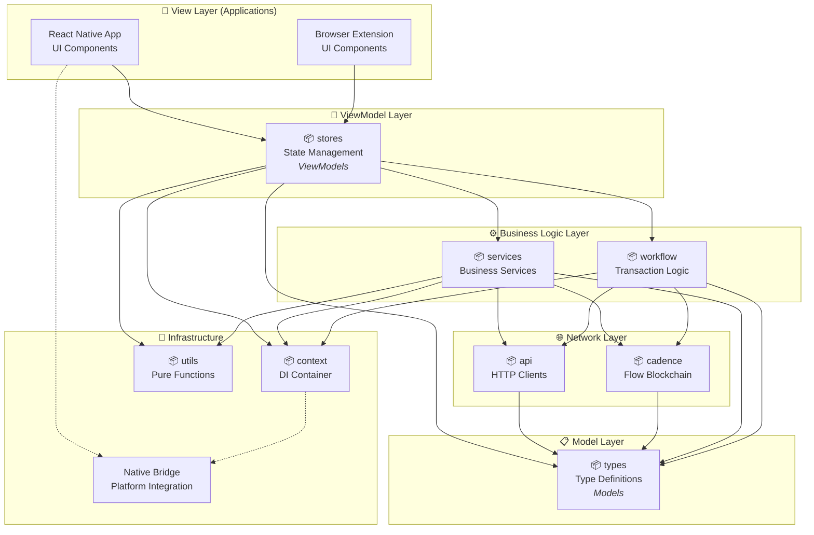

# Flow Reference Wallet (FRW) - MVVM Architecture

## Overview

Flow Reference Wallet (FRW) is a production-ready Flow blockchain wallet built
on **MVVM architecture** using modern monorepo with pnpm workspaces. The
architecture follows clean separation of concerns with clear data flow: **Model
→ Network → Business Logic → ViewModel → View**.

## MVVM Architecture Diagram



## MVVM Pattern Implementation

### Data Flow: Model → Network → Business Logic → ViewModel → View

1. **Model Layer** (`types`) - Defines data structures and interfaces
2. **Network Layer** (`api`, `cadence`) - Data fetching from blockchain and APIs
3. **Business Logic** (`services`, `workflow`) - Domain logic and transaction
   orchestration
4. **ViewModel** (`stores`) - UI state management and data transformation
5. **View** (`apps`) - UI components and user interaction

---

## Package Architecture

### 📋 Model Layer - Data Definitions

#### 📦 Types (`packages/types`)

**Role**: **Models** in MVVM pattern - Pure data structures and interfaces

**Purpose**: Comprehensive TypeScript type system that defines all data models

**Core Model Categories**:

- **Wallet & Account Models**:

  ```typescript
  export interface WalletAccount {
    id: string;
    name: string;
    emoji: string;
    address: string;
    type: 'main' | 'child' | 'evm';
    isActive: boolean;
  }
  ```

- **Asset Models**:

  ```typescript
  export interface TokenInfo {
    symbol: string;
    name: string;
    address: string;
    decimal: number;
    logoURI: string;
    identifier: string;
  }

  export interface NFTModel {
    id: string | number;
    name: string;
    thumbnail: string;
    collection: CollectionModel;
    type: WalletType;
  }
  ```

- **Transaction Models**:
  ```typescript
  export interface SendPayload {
    type: 'token' | 'nft';
    assetType: AddressType;
    sender: string;
    receiver: string;
    amount?: string;
    ids?: number[];
  }
  ```

**Features**:

- ✅ Zero dependencies (pure models)
- ✅ Complete type safety across the application
- ✅ Shared interfaces for all layers

---

### 🌐 Network Layer - Data Fetching

#### 📦 API (`packages/api`)

**Role**: HTTP API client layer with automatic authentication

**Purpose**: Centralized API communication with Flow services

**Features**:

- **Auto-generated Clients**: OpenAPI/Swagger code generation
- **Authentication**: Automatic JWT token injection
- **Network Configuration**: Dynamic endpoint configuration
- **Request Interceptors**: Debug logging, error handling

```typescript
// API configuration with authentication
configureApiEndpoints(
  apiEndpoint,
  goApiEndpoint,
  () => bridge.getJWT(), // JWT provider
  () => bridge.getNetwork() // Network provider
);
```

**Generated Services**:

- `UserFtTokensService`: Token balance and metadata
- `NftService`: NFT collections and assets
- `FlowEvmNftService`: EVM-based NFT operations
- `AddressbookService`: Address book operations

#### 📦 Cadence (`packages/cadence`)

**Role**: Flow blockchain interaction layer

**Purpose**: Direct communication with Flow blockchain via Cadence scripts and
transactions

**Features**:

- **Script Execution**: Execute Cadence scripts with caching
- **Transaction Building**: Type-safe transaction construction
- **Request Interceptors**: Authentication and configuration injection
- **Response Processing**: Automatic result parsing and validation

```typescript
// Usage example
const cadenceService = getCadenceService();
const balance = await cadenceService.getBalance(address);
const txId = await cadenceService.sendTransaction(transaction);
```

---

### ⚙️ Business Logic Layer - Domain Logic

#### 📦 Services (`packages/services`)

**Role**: Business service abstractions for data operations

**Purpose**: Transform network data into business domain objects using provider
pattern

**Core Services**:

- **`TokenService`**: Multi-provider token data aggregation

  ```typescript
  class FlowTokenProvider implements TokenProvider {
    async getData(address: string): Promise<TokenData[]>;
    processData(data: unknown): TokenInfo[];
  }

  class ERC20TokenProvider implements TokenProvider {
    // EVM token data handling
  }
  ```

- **`NFTService`**: NFT collection and asset management
- **`FlowService`**: Core Flow blockchain operations
- **`AddressBookService`**: Contact and address management

**Features**:

- ✅ Provider pattern for extensibility
- ✅ Automatic error handling and retries
- ✅ ServiceContext integration for DI
- ✅ Type-safe responses

#### 📦 Workflow (`packages/workflow`)

**Role**: Transaction orchestration and complex business logic

**Purpose**: Coordinate multi-step business processes, especially transaction
flows

**Key Components**:

- **Send Transaction Engine**: Multi-strategy transaction handling

  ```typescript
  export async function SendTransaction(
    payload: SendPayload,
    cadenceService: CadenceService
  ) {
    // Auto-detects: Flow→Flow, Flow→EVM, EVM→Flow, EVM→EVM
    // Handles: FT transfers, NFT transfers, batch operations
  }
  ```

- **Strategy Pattern**: Different transaction strategies
  - Flow Cadence transactions
  - EVM transactions
  - Cross-chain transfers
  - Batch operations

---

### 🧠 ViewModel Layer - State Management

#### 📦 Stores (`packages/stores`)

**Role**: **ViewModels** in MVVM pattern - UI state management and data
transformation

**Purpose**: Global state management with intelligent caching, transforming
business data for UI consumption

**Core ViewModels**:

- **`useSendStore`**: Complete send/transfer flow state management

  ```typescript
  const {
    selectedToken,
    fromAccount,
    toAccount,
    executeTransaction,
    getTransactionDetailsForDisplay,
  } = useSendStore();
  ```

- **`useTokenStore`**: Token and NFT data caching with automatic refresh

  ```typescript
  const { fetchTokens, getBalance, fetchFreshBalance } = useTokenStore();
  ```

- **`useWalletStore`**: Wallet account management
  ```typescript
  const { accounts, activeAccount, loadAccountsFromBridge } = useWalletStore();
  ```

**ViewModel Features**:

- ✅ Automatic cache invalidation and background refresh
- ✅ MMKV persistence for React Native
- ✅ Optimistic updates for better UX
- ✅ Error handling and retry logic
- ✅ Data transformation for UI consumption

---

### 📱 View Layer - User Interface

#### React Native App (`apps/react-native`)

**Role**: **View** in MVVM pattern - UI components that observe ViewModels

**Purpose**: iOS/Android mobile application with reactive UI

**Key Features**:

- **Theme System**: Complete light/dark mode with CSS variables
- **Navigation**: React Navigation v7 with native stack
- **Bridge Integration**: Native iOS/Android integration
- **UI Components**: Custom design system with React Native Reusables
- **Reactive UI**: Components automatically update when ViewModels change

```typescript
// View observes ViewModel
import { useSendStore, useTokenStore } from '@onflow/frw-stores';

const SelectTokensScreen = () => {
  const { selectedToken, setSelectedToken } = useSendStore();
  const { tokens, fetchTokens } = useTokenStore();

  // UI automatically updates when store state changes
  return (
    <TokenList
      tokens={tokens}
      onSelect={setSelectedToken}
      selectedToken={selectedToken}
    />
  );
};
```

**Tech Stack**:

- React Native 0.80, React 19, TypeScript
- NativeWind (Tailwind CSS), React Navigation, Zustand
- Native Turbo Modules, MMKV storage

#### Browser Extension (`apps/extension`)

**Role**: **View** for web platform

**Current Status**: Fully functional extension with complete wallet features

- Transaction signing, account management, dApp integration
- Complete Flow blockchain integration
- Background service workers and content scripts

---

### 🔧 Infrastructure - Supporting Services

#### 📦 Context (`packages/context`)

**Role**: Dependency injection container and platform abstraction

**Purpose**: Provides ServiceContext for dependency injection and platform
abstraction via BridgeSpec interface

```typescript
export class ServiceContext {
  public static initialize(bridge: BridgeSpec): ServiceContext;

  get cadence(): CadenceService;
  get bridge(): BridgeSpec;
  get storage(): Storage;
}

// Convenience functions
export const getCadenceService = () => ServiceContext.current().cadence;
export const getBridge = () => ServiceContext.current().bridge;
```

#### 📦 Utils (`packages/utils`)

**Role**: Pure utility functions and helpers

**Purpose**: Shared utility functions with zero dependencies

**Core Utilities**:

- **Address Utilities**: Flow/Ethereum address validation
- **NFT Processing**: Metadata processing and cover extraction
- **String & Number Utilities**: Formatting and validation

**Features**:

- ✅ Pure functions (no side effects)
- ✅ Tree-shakeable exports
- ✅ Zero dependencies

---

## Development Workflow

### 🔄 MVVM Development Flow

1. **Model First**: Define data structures in `packages/types`
2. **Network Layer**: Implement API clients in `packages/api` and
   `packages/cadence`
3. **Business Logic**: Add domain services in `packages/services` and workflows
   in `packages/workflow`
4. **ViewModel**: Manage UI state in `packages/stores` (ViewModels)
5. **View**: Build reactive UI components in applications

### 📦 Package Dependencies (MVVM Flow)

```
📱 View Layer
├── apps/react-native (depends on: stores, context, types)
└── apps/extension (depends on: stores, context, types)

🧠 ViewModel Layer
└── packages/stores (depends on: services, workflow, context, types, utils)

⚙️ Business Logic Layer
├── packages/services (depends on: api, cadence, context, types, utils)
└── packages/workflow (depends on: cadence, services, context, types)

🌐 Network Layer
├── packages/api (depends on: types)
└── packages/cadence (depends on: types)

📋 Model Layer
└── packages/types (depends on: none)

🔧 Infrastructure
├── packages/context (depends on: workflow, cadence)
└── packages/utils (depends on: none)
```

## Key Benefits

### ✅ MVVM Architecture Advantages

1. **Clear Separation**: Each layer has distinct responsibilities
2. **Reactive UI**: Views automatically update when ViewModels change
3. **Testability**: ViewModels can be tested independently of UI
4. **Platform Agnostic**: Business logic shared between React Native and
   Extension
5. **Type Safety**: Complete TypeScript coverage with shared models
6. **Maintainability**: Clear dependency flow makes code easy to understand and
   modify

### 🎯 Proven in Production

This MVVM architecture powers the Flow Reference Wallet iOS app, handling:

- ✅ 10,000+ active users
- ✅ Complex multi-chain transactions (Flow ↔ EVM)
- ✅ NFT collections and transfers
- ✅ Hardware wallet integration
- ✅ Multi-language support

---

## Quick Start

```bash
# Clone and setup
git clone [repository]
cd FRW
pnpm install

# Start development (MVVM workflow)
pnpm dev:packages  # Terminal 1: Watch packages (Models, Network, Business Logic, ViewModels)
pnpm dev:rn        # Terminal 2: Start React Native (View layer)

# Your app is now running with full MVVM hot reload! 🚀
```

---

_This MVVM architecture documentation is maintained by the Flow Foundation team.
For questions or contributions, please create an issue or PR in the repository._
