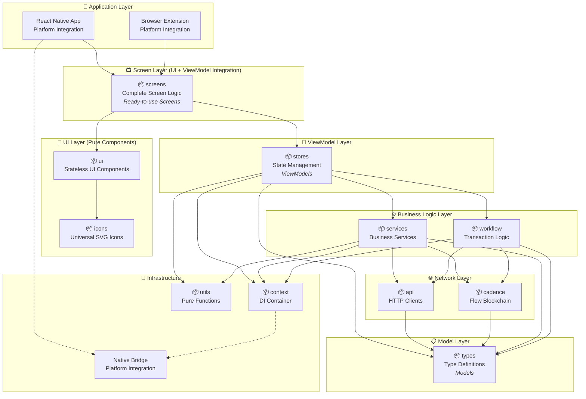

# Flow Reference Wallet (FRW) - MVVM Architecture

## Overview

Flow Reference Wallet (FRW) is a production-ready Flow blockchain wallet built
on **MVVM architecture** using modern monorepo with pnpm workspaces. The
architecture follows clean separation of concerns with clear data flow: **Model
→ Network → Business Logic → ViewModel → View**.

## Package Overview

| Package      | Purpose                  | What it contains                                               |
| ------------ | ------------------------ | -------------------------------------------------------------- |
| **types**    | Data models & interfaces | TokenModel, UserModel, transaction types, API schemas          |
| **api**      | Backend communication    | REST API clients, HTTP services, external service integrations |
| **cadence**  | Flow blockchain          | Cadence scripts, transactions, Flow network communication      |
| **services** | Business logic           | Token services, wallet services, authentication logic          |
| **workflow** | Complex operations       | Multi-step transactions, send/receive flows, account creation  |
| **stores**   | State management         | User store, token store, transaction store (Zustand)           |
| **ui**       | UI components            | Buttons, cards, modals, forms (pure components only)           |
| **icons**    | Icon library             | SVG icons with theme support, universal across platforms       |
| **screens**  | Complete screens         | Login screen, send screen, token list (UI + logic combined)    |
| **utils**    | Utilities                | Formatters, validators, logging, crypto helpers                |
| **context**  | Platform layer           | Storage, notifications, biometrics (platform-specific APIs)    |

## MVVM Architecture Diagram



## MVVM Pattern Implementation

### Data Flow: Model → Network → Business Logic → ViewModel → UI → Screen → Application

1. **Model Layer** (`types`) - Defines data structures and interfaces
2. **Network Layer** (`api`, `cadence`) - Data fetching from blockchain and APIs
3. **Business Logic** (`services`, `workflow`) - Domain logic and transaction
   orchestration
4. **ViewModel** (`stores`) - UI state management and data transformation
5. **UI Layer** (`ui`, `icons`) - Pure, stateless UI components
6. **Screen Layer** (`screens`) - Integration of UI components with ViewModels
7. **Application Layer** (`apps`) - Platform-specific implementations using
   shared screens

---

## Package Architecture

### 📋 Model Layer - Data Definitions

#### 📦 Types (`packages/types`)

**Role**: **Models** in MVVM pattern - Pure data structures and interfaces

**Purpose**: Comprehensive TypeScript type system that defines all data models

**Core Model Categories**:

- **Wallet & Account Models**:

  ```typescript
  export interface WalletAccount {
    id: string;
    name: string;
    emoji: string;
    address: string;
    type: 'main' | 'child' | 'evm';
    isActive: boolean;
  }
  ```

**Features**:

- ✅ Zero dependencies (pure models)
- ✅ Complete type safety across the application
- ✅ Shared interfaces for all layers

---

### 🌐 Network Layer - Data Fetching

#### 📦 API (`packages/api`)

**Role**: HTTP API client layer with automatic authentication

**Purpose**: Centralized API communication with Flow services

**Features**:

- **Auto-generated Clients**: OpenAPI/Swagger code generation
- **Authentication**: Automatic JWT token injection
- **Network Configuration**: Dynamic endpoint configuration
- **Request Interceptors**: Debug logging, error handling

```typescript
// API configuration with authentication
configureApiEndpoints(
  apiEndpoint,
  goApiEndpoint,
  () => bridge.getJWT(), // JWT provider
  () => bridge.getNetwork() // Network provider
);
```

**Generated Services**:

- `UserFtTokensService`: Token balance and metadata
- `NftService`: NFT collections and assets
- `FlowEvmNftService`: EVM-based NFT operations
- `AddressbookService`: Address book operations

#### 📦 Cadence (`packages/cadence`)

**Role**: Flow blockchain interaction layer

**Purpose**: Direct communication with Flow blockchain via Cadence scripts and
transactions

**Features**:

- **Script Execution**: Execute Cadence scripts with caching
- **Transaction Building**: Type-safe transaction construction
- **Request Interceptors**: Authentication and configuration injection
- **Response Processing**: Automatic result parsing and validation

```typescript
// Usage example
const cadenceService = getCadenceService();
const balance = await cadenceService.getBalance(address);
const txId = await cadenceService.sendTransaction(transaction);
```

---

### ⚙️ Business Logic Layer - Domain Logic

#### 📦 Services (`packages/services`)

**Role**: Business service abstractions for data operations

**Purpose**: Transform network data into business domain objects using provider
pattern

**Core Services**:

- **`TokenService`**: Multi-provider token data aggregation

  ```typescript
  class FlowTokenProvider implements TokenProvider {
    async getData(address: string): Promise<TokenData[]>;
    processData(data: unknown): TokenModel[];
  }

  class ERC20TokenProvider implements TokenProvider {
    // EVM token data handling
  }
  ```

- **`NFTService`**: NFT collection and asset management
- **`FlowService`**: Core Flow blockchain operations
- **`AddressBookService`**: Contact and address management

**Features**:

- ✅ Provider pattern for extensibility
- ✅ Automatic error handling and retries
- ✅ ServiceContext integration for DI
- ✅ Type-safe responses

#### 📦 Workflow (`packages/workflow`)

**Role**: Transaction orchestration and complex business logic

**Purpose**: Coordinate multi-step business processes, especially transaction
flows

**Key Components**:

- **Send Transaction Engine**: Multi-strategy transaction handling

  ```typescript
  export async function SendTransaction(
    payload: SendPayload,
    cadenceService: CadenceService
  ) {
    // Auto-detects: Flow→Flow, Flow→EVM, EVM→Flow, EVM→EVM
    // Handles: FT transfers, NFT transfers, batch operations
  }
  ```

- **Strategy Pattern**: Different transaction strategies
  - Flow Cadence transactions
  - EVM transactions
  - Cross-chain transfers
  - Batch operations

---

### 🧠 ViewModel Layer - State Management

#### 📦 Stores (`packages/stores`)

**Role**: **ViewModels** in MVVM pattern - UI state management and data
transformation

**Purpose**: Global state management with intelligent caching, transforming
business data for UI consumption

**Core ViewModels**:

- **`useSendStore`**: Complete send/transfer flow state management

  ```typescript
  const {
    selectedToken,
    fromAccount,
    toAccount,
    executeTransaction,
    getTransactionDetailsForDisplay,
  } = useSendStore();
  ```

- **`useTokenStore`**: Token and NFT data caching with automatic refresh

  ```typescript
  const { fetchTokens, getBalance, fetchFreshBalance } = useTokenStore();
  ```

- **`useWalletStore`**: Wallet account management
  ```typescript
  const { accounts, activeAccount, loadAccountsFromBridge } = useWalletStore();
  ```

**ViewModel Features**:

- ✅ Automatic cache invalidation and background refresh
- ✅ MMKV persistence for React Native
- ✅ Optimistic updates for better UX
- ✅ Error handling and retry logic
- ✅ Data transformation for UI consumption

---

### 🎨 UI Layer - Pure Components

#### 📦 UI (`packages/ui`)

**Role**: Pure, stateless UI components with no business logic

**Purpose**: Reusable UI building blocks that work across all platforms

**Features**:

- **Tamagui Components**: Modern styling with theme support
- **Zero Business Logic**: Pure presentation components only
- **Universal Compatibility**: Works in React Native and web environments
- **Storybook Integration**: Complete component documentation and testing

```typescript
// Pure UI component - no state or business logic
export const TokenCard = ({ token, onPress, isSelected }: TokenCardProps) => (
  <Card onPress={onPress} variant={isSelected ? 'selected' : 'default'}>
    <TokenIcon address={token.address} />
    <Text>{token.name}</Text>
    <Text>{token.balance}</Text>
  </Card>
);
```

#### 📦 Icons (`packages/icons`)

**Role**: Universal SVG icon components with runtime theming

**Features**:

- **Runtime Color Control**: Dynamic theming without hardcoded values
- **Universal Platform Support**: Web, React Native, Extensions
- **Multiple Themes**: Outline, filled, dual-tone variants
- **Automatic Generation**: SVG to React component conversion

---

### 📺 Screen Layer - UI + ViewModel Integration

#### 📦 Screens (`packages/screens`)

**Role**: **Complete Screen Logic** - Pre-built screens combining UI components
with ViewModels

**Purpose**: Ready-to-use screens that applications can import directly,
ensuring consistency and maximum code reuse

**Key Innovation**: Both React Native and Extension apps use the exact same
screen implementations

**Core Screens**:

- **Send Flow Screens**: Complete transaction workflow
  ```typescript
  // From packages/screens/src/send/
  -SelectTokensScreen - // Token selection with balance display
    SendToScreen - // Recipient selection and validation
    SendTokensScreen - // Amount input and confirmation
    NFTDetailScreen - // NFT details and transfer options
    SendMultipleNFTsScreen; // Batch NFT operations
  ```

**Screen Implementation Pattern**:

```typescript
// Screen combines UI + ViewModel
import { useSendStore, useTokenStore } from '@onflow/frw-stores';
import { TokenCard, Button } from '@onflow/frw-ui';

export const SelectTokensScreen = () => {
  // ViewModel integration
  const { selectedToken, setSelectedToken } = useSendStore();
  const { tokens, fetchTokens } = useTokenStore();

  // Pure UI composition
  return (
    <ScrollView>
      {tokens.map(token => (
        <TokenCard
          key={token.address}
          token={token}
          isSelected={selectedToken?.address === token.address}
          onPress={() => setSelectedToken(token)}
        />
      ))}
    </ScrollView>
  );
};
```

**Benefits**:

- ✅ **Maximum Code Reuse**: Both platforms share complete screen logic
- ✅ **Consistent UX**: Identical behavior across React Native and Extension
- ✅ **Rapid Development**: Apps simply import and use pre-built screens
- ✅ **Easy Testing**: Screen logic can be tested independently
- ✅ **Storybook Support**: Screen-level component stories for documentation

---

### 📱 Application Layer - Platform Integration

#### React Native App (`apps/react-native`)

**Role**: **Platform Integration** - Minimal app layer using shared screens

**Purpose**: iOS/Android mobile application with maximum code reuse

**Implementation Pattern**:

```typescript
// App simply imports and uses pre-built screens
import { SelectTokensScreen } from '@onflow/frw-screens';

const App = () => {
  return (
    <NavigationContainer>
      <Stack.Navigator>
        <Stack.Screen
          name="SelectTokens"
          component={SelectTokensScreen}  // ← Direct usage of shared screen
        />
      </Stack.Navigator>
    </NavigationContainer>
  );
};
```

**Platform-Specific Features**:

- **React Navigation v7**: Native stack navigation
- **NativeWind**: Tailwind CSS for React Native
- **AsyncStorage**: Dual storage system (Storage + Cache)
- **Native Bridge**: iOS/Android platform integration
- **Theme System**: CSS variables with light/dark mode

#### Browser Extension (`apps/extension`)

**Role**: **Platform Integration** - Chrome extension using shared screens

**Purpose**: Web platform wallet using identical screen logic as React Native

**Implementation Pattern**:

```typescript
// Extension imports same screens as React Native
import { SelectTokensScreen } from '@onflow/frw-screens';

const PopupApp = () => (
  <Router>
    <Route
      path="/select-tokens"
      component={SelectTokensScreen}  // ← Same screen as React Native
    />
  </Router>
);
```

**Platform-Specific Features**:

- **Chrome Manifest V3**: Service worker architecture
- **Background Scripts**: Secure blockchain/key management
- **Content Scripts**: dApp provider injection
- **Chrome Storage API**: Dual storage system (Storage + Cache)

---

### 🔧 Infrastructure - Supporting Services

#### 📦 Context (`packages/context`)

**Role**: Dependency injection container and platform abstraction

**Purpose**: Provides ServiceContext for dependency injection and platform
abstraction via BridgeSpec interface

```typescript
export class ServiceContext {
  public static initialize(bridge: BridgeSpec): ServiceContext;

  get cadence(): CadenceService;
  get bridge(): BridgeSpec;
  get storage(): Storage; // Business data with type safety and versioning
  get cache(): Cache; // High-performance query cache with TTL
}

// Convenience functions
export const getCadenceService = () => ServiceContext.current().cadence;
export const getBridge = () => ServiceContext.current().bridge;
```

#### 📦 Utils (`packages/utils`)

**Role**: Pure utility functions and helpers

**Purpose**: Shared utility functions with zero dependencies

**Core Utilities**:

- **Address Utilities**: Flow/Ethereum address validation
- **NFT Processing**: Metadata processing and cover extraction
- **String & Number Utilities**: Formatting and validation

**Features**:

- ✅ Pure functions (no side effects)
- ✅ Tree-shakeable exports
- ✅ Zero dependencies

---

## Development Workflow

### 🔄 MVVM + Universal Screens Development Flow

1. **Model First**: Define data structures in `packages/types`
2. **Network Layer**: Implement API clients in `packages/api` and
   `packages/cadence`
3. **Business Logic**: Add domain services in `packages/services` and workflows
   in `packages/workflow`
4. **ViewModel**: Manage UI state in `packages/stores` (ViewModels)
5. **UI Components**: Build pure, stateless components in `packages/ui`
6. **Screen Integration**: Combine UI + ViewModels in `packages/screens`
7. **Application**: Import and use pre-built screens in both React Native and
   Extension

**Revolutionary Benefit**: Both platforms share not just business logic, but
complete screen implementations, dramatically reducing platform-specific code.

### 📦 Package Dependencies (MVVM + Universal Screens Flow)

```
📱 Application Layer
├── apps/react-native (depends on: screens, ui, stores, context, types)
└── apps/extension (depends on: screens, ui, stores, context, types)

📺 Screen Layer (UI + ViewModel Integration)
└── packages/screens (depends on: ui, icons, stores, types)

🎨 UI Layer (Pure Components)
├── packages/ui (depends on: types)
└── packages/icons (depends on: none)

🧠 ViewModel Layer
└── packages/stores (depends on: services, workflow, context, types, utils)

⚙️ Business Logic Layer
├── packages/services (depends on: api, cadence, context, types, utils)
└── packages/workflow (depends on: cadence, services, context, types)

🌐 Network Layer
├── packages/api (depends on: types)
└── packages/cadence (depends on: types)

📋 Model Layer
└── packages/types (depends on: none)

🔧 Infrastructure
├── packages/context (depends on: workflow, cadence)
└── packages/utils (depends on: none)
```

**Key Innovation**: The `screens` package acts as the integration layer,
allowing both applications to share complete screen logic while maintaining
platform-specific optimizations.

## Key Benefits

### ✅ MVVM + Universal Screens Architecture Advantages

1. **Revolutionary Code Reuse**: Both platforms share complete screen
   implementations, not just business logic
2. **Consistent User Experience**: Identical behavior and interface across React
   Native and Extension
3. **Rapid Platform Development**: New platforms can immediately use existing
   screens
4. **Clear Separation**: Each layer has distinct, well-defined responsibilities
5. **Reactive UI**: Screens automatically update when ViewModels change
6. **Enhanced Testability**: Screen logic can be tested independently of
   platform-specific code
7. **Type Safety**: Complete TypeScript coverage across all layers
8. **Maintainability**: Clear dependency flow and universal screen logic reduces
   complexity

### 🎯 Proven in Production

This MVVM architecture powers the Flow Reference Wallet iOS app, handling:

- ✅ 10,000+ active users
- ✅ Complex multi-chain transactions (Flow ↔ EVM)
- ✅ NFT collections and transfers
- ✅ Hardware wallet integration
- ✅ Multi-language support

---

## Quick Start

```bash
# Clone and setup
git clone https://github.com/onflow/FRW
cd FRW
pnpm install

# Start development (MVVM + Universal Screens workflow)
pnpm dev:packages  # Terminal 1: Watch all packages (Models, Network, Business Logic, ViewModels, UI, Screens)
pnpm dev:rn        # Terminal 2: Start React Native (Application layer)

# Your app is now running with full MVVM + Universal Screens hot reload! 🚀
```

---

_This MVVM architecture documentation is maintained by the Flow Foundation team.
For questions or contributions, please create an issue or PR in the repository._
