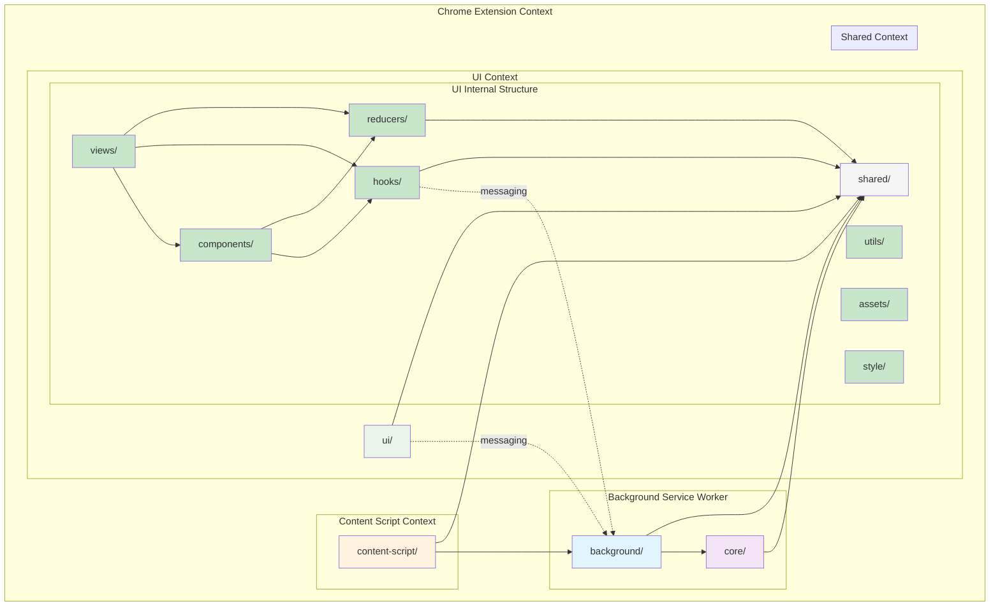

# Flow Reference Wallet - Architecture Separation

## Folder Structure & Import Rules

This document outlines the architectural boundaries and import rules enforced by ESLint in the Flow Reference Wallet Chrome extension.

## Overview

The codebase is organized into distinct layers with strict import rules to maintain separation of concerns and prevent architectural violations. Each folder has specific responsibilities and controlled dependencies.

## Folder Structure

```
src/
├── background/          # Chrome extension background scripts
├── core/               # Core business logic and services
├── ui/                 # Popup UI components and views
│   ├── components/     # Reusable UI components
│   ├── views/         # Page-level components and screens
│   ├── hooks/         # Custom React hooks
│   ├── reducers/      # State management reducers
│   ├── utils/         # UI-specific utilities
│   ├── assets/        # Static assets (images, fonts, etc.)
│   └── style/         # Styling and theming
├── content-script/     # Web page content scripts
└── shared/            # Shared utilities and types
```

## Architecture Diagram



## Layer Responsibilities

### 1. Background (`src/background/`)

- **Purpose**: Chrome extension background service worker
- **Responsibilities**:
  - Extension lifecycle management
  - Message routing between UI and core
  - Chrome API interactions
  - Wallet controller coordination
- **Can import from**: `@/core/*`, `@/shared/*`
- **Cannot import from**: `@/ui/*`

### 2. Core (`src/core/`)

- **Purpose**: Core business logic and services
- **Responsibilities**:
  - Wallet services (keyring, transactions, etc.)
  - Blockchain interactions
  - Business logic
  - Data persistence
- **Can import from**: `@/shared/*`, `@/background/webapi/*`
- **Cannot import from**: `@/ui/*`, `@/background/*` (except webapi)

### 3. UI (`src/ui/`)

- **Purpose**: Popup interface and user interactions
- **Responsibilities**:
  - React components and views
  - User interface logic
  - State management for display
  - User input handling
- **Can import from**: `@/shared/*`
- **Cannot import from**: `@/core/*`, `@/background/*`
- **Communication**: Uses messaging to communicate with background/wallet controller

#### UI Internal Structure

##### 3.1. Views (`src/ui/views/`)

- **Purpose**: Page-level components and complete screens
- **Responsibilities**:
  - Route components
  - Page layouts
  - Screen orchestration
  - Complex user flows
- **Can import from**: `@/ui/components/*`, `@/ui/hooks/*`, `@/ui/reducers/*`, `@/ui/utils/*`, `@/ui/assets/*`, `@/ui/style/*`, `@/shared/*`
- **Import pattern**: Views compose components and use hooks for state management

##### 3.2. Components (`src/ui/components/`)

- **Purpose**: Reusable UI components
- **Responsibilities**:
  - Atomic UI elements
  - Reusable component patterns
  - Component composition
  - UI interactions
- **Can import from**: `@/ui/hooks/*`, `@/ui/reducers/*`, `@/ui/utils/*`, `@/ui/assets/*`, `@/ui/style/*`, `@/shared/*`
- **Cannot import from**: `@/ui/views/*` (components should not depend on views)

##### 3.3. Hooks (`src/ui/hooks/`)

- **Purpose**: Custom React hooks for state and side effects
- **Responsibilities**:
  - State management logic
  - Background communication
  - Storage interactions
  - Custom React patterns
- **Can import from**: `@/ui/reducers/*`, `@/ui/utils/*`, `@/shared/*`
- **Special permissions**: Can communicate with background via messaging
- **Cannot import from**: `@/ui/views/*`, `@/ui/components/*`

##### 3.4. Reducers (`src/ui/reducers/`)

- **Purpose**: State management and data transformations
- **Responsibilities**:
  - State reduction logic
  - Data transformations
  - Action handling
  - Pure state functions
- **Can import from**: `@/shared/*` only
- **Cannot import from**: Any other UI subfolder or external folders
- **Note**: Must remain pure and isolated for predictable state management

##### 3.5. Utils (`src/ui/utils/`)

- **Purpose**: UI-specific utility functions
- **Responsibilities**:
  - UI helper functions
  - Formatting utilities
  - UI-specific calculations
  - Browser API wrappers
- **Can import from**: `@/shared/*`
- **Cannot import from**: Other UI subfolders (to prevent circular dependencies)

##### 3.6. Assets (`src/ui/assets/`)

- **Purpose**: Static assets for the UI
- **Responsibilities**:
  - Images, icons, fonts
  - Static JSON data
  - SVG assets
- **Import pattern**: Imported by other UI components using `@/ui/assets/*`

##### 3.7. Style (`src/ui/style/`)

- **Purpose**: Styling and theming
- **Responsibilities**:
  - Theme definitions
  - CSS utilities
  - Design tokens
  - Global styles
- **Can import from**: `@/shared/*` (for shared constants)
- **Import pattern**: Imported by components for styling

### 4. Content Script (`src/content-script/`)

- **Purpose**: Web page integration
- **Responsibilities**:
  - dApp provider injection
  - Web page communication
  - Flow FCL and Ethereum provider interfaces
- **Can import from**: `@/background/*`, `@/shared/*`

### 5. Shared (`src/shared/`)

- **Purpose**: Common utilities and types
- **Responsibilities**:
  - Type definitions
  - Utility functions
  - Constants
  - Common helpers
- **Can import from**: Nothing outside shared
- **Cannot import from**: Any other folder

## Import Rules

### Alias Imports (Required between folders)

Use aliases when importing between different folders:

```typescript
// ✅ Correct - using aliases
import { SomeType } from '@/shared/types/some-type';
import { walletService } from '@/core/service/wallet';
import { storage } from '@/shared/utils/storage';

// ✅ Correct - UI internal with aliases
import { Button } from '@/ui/components/Button';
import { useWallet } from '@/ui/hooks/use-wallet';
import { accountReducer } from '@/ui/reducers/account-reducer';
```

### Relative Imports (Only within same subfolder)

Use relative imports only within the same subfolder:

```typescript
// ✅ Correct - within same subfolder
import { helper } from './helper';
import { Component } from '../SubFolder/Component';
import { utils } from '../../utils/index';
```

### UI Import Hierarchy

```typescript
// ✅ Views can import components
import { AccountCard } from '@/ui/components/account/account-card';

// ✅ Components can import hooks
import { useWallet } from '@/ui/hooks/use-wallet';

// ✅ Hooks can import reducers
import { accountReducer } from '@/ui/reducers/account-reducer';

// ✅ Anyone can import from shared
import { formatAddress } from '@/shared/utils/address';
```

### Forbidden Patterns

```typescript
// ❌ Wrong - relative imports between UI subfolders
import { Component } from '../../components/Component';
import { useHook } from '../hooks/use-hook';

// ❌ Wrong - components importing views
import { Dashboard } from '@/ui/views/Dashboard';

// ❌ Wrong - reducers importing from UI subfolders
import { useWallet } from '@/ui/hooks/use-wallet';

// ❌ Wrong - UI importing from core
import { keyringService } from '@/core/service/keyring';

// ❌ Wrong - shared importing from other folders
import { UIComponent } from '@/ui/components/UIComponent';
```

## Communication Patterns

### UI ↔ Background Communication

UI communicates with background through Chrome extension messaging:

```typescript
// UI hooks
export const useWallet = () => {
  const walletController = new WalletController();

  const getAccounts = async () => {
    return await walletController.getAccounts();
  };

  return { getAccounts };
};

// Background side
chrome.runtime.onMessage.addListener((message, sender, sendResponse) => {
  // Handle messages from UI
});
```

### UI Internal Communication

```typescript
// Views use components and hooks
const Dashboard = () => {
  const { accounts } = useWallet(); // Hook for data

  return (
    <div>
      <AccountCard account={accounts[0]} /> {/* Component for UI */}
    </div>
  );
};

// Hooks use reducers for state management
const useWallet = () => {
  const [state, dispatch] = useReducer(walletReducer, initialState);
  // ...
};
```

### Background ↔ Core Communication

Background directly imports and uses core services:

```typescript
// Background
import { keyringService } from '@/core/service/keyring';
const accounts = await keyringService.getAccounts();
```

## ESLint Enforcement

The following ESLint rules enforce these architectural boundaries:

1. **Background folder**: Must use aliases for imports outside background
2. **Core folder**: Cannot import from UI, must use aliases for external imports
3. **UI folder**: Cannot import from core, must use aliases between UI subfolders
4. **UI reducers**: Can only import from shared
5. **Content script**: Must use aliases for external imports
6. **Shared folder**: Cannot import from any other folder

## Benefits

This architecture provides:

- **Clear separation of concerns**: Each layer has distinct responsibilities
- **Maintainable codebase**: Easier to understand and modify
- **Testable code**: Isolated layers can be tested independently
- **Chrome extension compliance**: Proper separation between contexts
- **Security**: Background service worker isolation
- **Scalability**: Clear boundaries for future development
- **Predictable state management**: Isolated reducers ensure predictable state changes
- **Reusable components**: Components can be used across different views
- **Organized UI structure**: Clear hierarchy from views → components → hooks → reducers

## Development Guidelines

1. **Before adding imports**: Check if the import follows the architectural rules
2. **Use aliases**: Always use `@/folder/*` aliases for cross-folder imports
3. **Keep layers isolated**: Don't create direct dependencies between UI and core
4. **Use messaging**: UI should communicate with core through background messaging
5. **Shared utilities**: Put common code in shared, not in specific layers
6. **UI hierarchy**: Follow views → components → hooks → reducers pattern
7. **Pure reducers**: Keep reducers isolated and pure for predictable state management
8. **Reusable components**: Design components to be reusable across different views

## Violations and Fixes

If you encounter ESLint violations:

1. **"Files in X folder cannot import from Y"**: Move the import to an allowed layer or use messaging
2. **"Must use aliases instead of relative paths"**: Replace relative imports with `@/folder/*` aliases
3. **"Cannot import outside of folder"**: The code belongs in a different layer or shared
4. **"UI subfolders must use aliases"**: Replace relative imports between UI subfolders with `@/ui/*` aliases
5. **"Reducers can only import from shared"**: Move the logic to hooks or use shared utilities

This architecture ensures a maintainable, secure, and scalable Chrome extension codebase with clear separation of concerns at both the application and UI levels.
