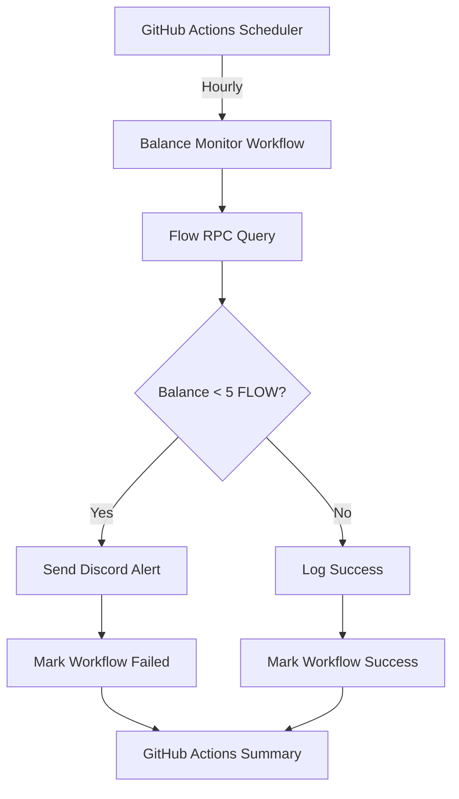

# Flow Account Balance Monitoring

## Overview

This document describes the automated balance monitoring system for critical
Flow accounts in the Flow Reference Wallet (FRW) project. The system prevents
service disruptions by alerting when account balances fall below safe
thresholds.

## Quick Start

### 1. Set Up Discord Webhook

1. Go to your Discord server settings
2. Navigate to **Integrations** → **Webhooks**
3. Click **Create Webhook**
4. Name it "Flow Balance Monitor"
5. Choose the channel for alerts (e.g., #alerts or #devops)
6. Copy the webhook URL

### 2. Configure GitHub Repository Secrets

Navigate to **Settings** → **Secrets and variables** → **Actions** and add these
secrets:

| Secret Name                    | Description                       | Example                                |
| ------------------------------ | --------------------------------- | -------------------------------------- |
| `DISCORD_WEBHOOK_URL`          | Discord webhook for notifications | `https://discord.com/api/webhooks/...` |
| `PAYER_ACCOUNT_ADDRESS`        | Main payer account address        | `0x1234567890abcdef`                   |
| `CREATOR_ACCOUNT_ADDRESS`      | Service creator account           | `0xfedcba0987654321`                   |
| `BRIDGE_PAYER_ACCOUNT_ADDRESS` | Bridge operations account         | `0xabcdef1234567890`                   |

### 3. Test the Setup

Run the test script locally to verify everything works:

```bash
# Install dependencies
npm install axios

# Test without Discord (tests Flow RPC only)
node .github/workflows/test-balance-monitor.js

# Test with Discord webhook
DISCORD_WEBHOOK_URL="your-webhook-url" node .github/workflows/test-balance-monitor.js
```

### 4. Enable the Workflow

The workflow will automatically:

- Run every hour
- Check all configured account balances
- Send Discord alerts if any account has < 5 FLOW
- Provide detailed status in GitHub Actions

## Architecture



## Monitored Accounts

### Account Types

1. **Payer Account** 💳
   - **Purpose**: Pays transaction fees for user operations
   - **Critical Level**: High - affects all user transactions
   - **Typical Usage**: ~50-100 FLOW per day

2. **Creator Account** 🏭
   - **Purpose**: Service account for wallet creation and management
   - **Critical Level**: High - affects new user onboarding
   - **Typical Usage**: ~10-20 FLOW per day

3. **Bridge Payer Account** 🌉
   - **Purpose**: Cross-chain bridge transaction fees
   - **Critical Level**: Medium - affects bridge operations
   - **Typical Usage**: ~20-50 FLOW per day

### Balance Thresholds

| Alert Level | Threshold | Action Required  |
| ----------- | --------- | ---------------- |
| 🟢 Healthy  | > 5 FLOW  | None             |
| 🟡 Warning  | 2-5 FLOW  | Monitor closely  |
| 🔴 Critical | < 2 FLOW  | Immediate top-up |

## Alert System

### Discord Notifications

When triggered, you'll receive rich notifications like:

```
🚨 Critical Flow Account Balance Alert

Action Required: The following accounts have fallen below the 5.0 FLOW threshold

💳 Payer Account
Address: 0x1234567890abcdef
Balance: 3.2500 FLOW
Purpose: Transaction fee payments

🌉 Bridge Payer Account
Address: 0xabcdef1234567890
Balance: 4.7500 FLOW
Purpose: Cross-chain operations

Flow Reference Wallet Monitor • 2024-01-15T14:30:00.000Z
```

### GitHub Actions Status

- **Success** ✅: All accounts above threshold
- **Failure** ❌: One or more accounts need attention
- **Workflow Summary**: Detailed status and next steps

## Operations Guide

### Responding to Alerts

1. **Immediate Action** (< 2 FLOW)

   ```bash
   # Check current balance
   flow accounts get 0xYOUR_ACCOUNT_ADDRESS --network mainnet

   # Top up the account
   flow transactions send ./top-up-transaction.cdc --network mainnet
   ```

2. **Planned Action** (2-5 FLOW)
   - Schedule balance top-up within 24 hours
   - Monitor usage patterns
   - Consider increasing threshold if frequently triggered

3. **Investigation**
   - Check recent transaction history
   - Identify unusual spending patterns
   - Verify account permissions and access

### Manual Monitoring

You can manually trigger the workflow:

1. Go to **Actions** tab in GitHub
2. Select "Flow Account Balance Monitor"
3. Click **Run workflow**
4. Review results in workflow summary

### Account Balance Commands

```bash
# Check account balance via Flow CLI
flow accounts get 0xACCOUNT_ADDRESS --network mainnet

# Check account info (includes balance)
curl -X POST https://rest-mainnet.onflow.org/v1/accounts/0xACCOUNT_ADDRESS

# Transfer FLOW to account
flow transactions send transfer-flow.cdc 10.0 0xRECIPIENT_ADDRESS --network mainnet
```

## Troubleshooting

### Common Issues

#### No Alerts Received

- Verify Discord webhook URL is correct and active
- Check webhook permissions in Discord channel
- Test webhook manually using test script

#### False Positives

- Verify account addresses are correct
- Check if accounts exist on mainnet (not testnet)
- Confirm addresses have proper Flow format

#### Workflow Not Running

- Ensure GitHub Actions are enabled for repository
- Check workflow file is in `.github/workflows/` directory
- Verify cron syntax is correct

#### RPC Connection Errors

- Flow RPC may be temporarily unavailable
- Check Flow network status: https://status.onflow.org
- Consider adding backup RPC endpoints

### Debug Commands

```bash
# Test Flow RPC connectivity
curl -X POST https://rest-mainnet.onflow.org/v1/scripts \
  -H "Content-Type: application/json" \
  -d '{"script":"'$(echo 'access(all) fun main(): String { return "OK" }' | base64)'"}'

# Test Discord webhook
curl -X POST "YOUR_WEBHOOK_URL" \
  -H "Content-Type: application/json" \
  -d '{"content": "Test from balance monitor"}'

# Check account exists
flow accounts get 0xACCOUNT_ADDRESS --network mainnet
```

## Customization

### Adjusting Thresholds

Edit the workflow file:

```yaml
env:
  BALANCE_THRESHOLD: '10.0' # Increase to 10 FLOW
```

### Adding Accounts

1. Add GitHub secret for new account address
2. Update `CRITICAL_ACCOUNTS` array in workflow:

```javascript
{
  name: 'New Service Account',
  address: process.env.NEW_SERVICE_ACCOUNT_ADDRESS,
  emoji: '🔥',
  description: 'New service operations'
}
```

### Changing Schedule

Modify cron expression:

```yaml
schedule:
  - cron: '0 */6 * * *' # Every 6 hours
  - cron: '0 9 * * MON' # Every Monday at 9 AM
```

## Security Considerations

- Account addresses stored as encrypted GitHub secrets
- No private keys handled by monitoring system
- Discord webhook URL encrypted in repository secrets
- Rate limiting prevents Flow RPC abuse
- Workflow runs in isolated GitHub Actions environment
- All communications use HTTPS/TLS encryption

## Monitoring Metrics

The system tracks:

- Account balance history
- Alert frequency per account
- RPC response times and errors
- Discord notification delivery status
- Workflow execution success rate

## Related Documentation

- [Flow CLI Documentation](https://docs.onflow.org/flow-cli/)
- [Flow REST API](https://docs.onflow.org/http-api/)
- [GitHub Actions Workflow Syntax](https://docs.github.com/en/actions/reference/workflow-syntax-for-github-actions)
- [Discord Webhooks Guide](https://support.discord.com/hc/en-us/articles/228383668-Intro-to-Webhooks)
