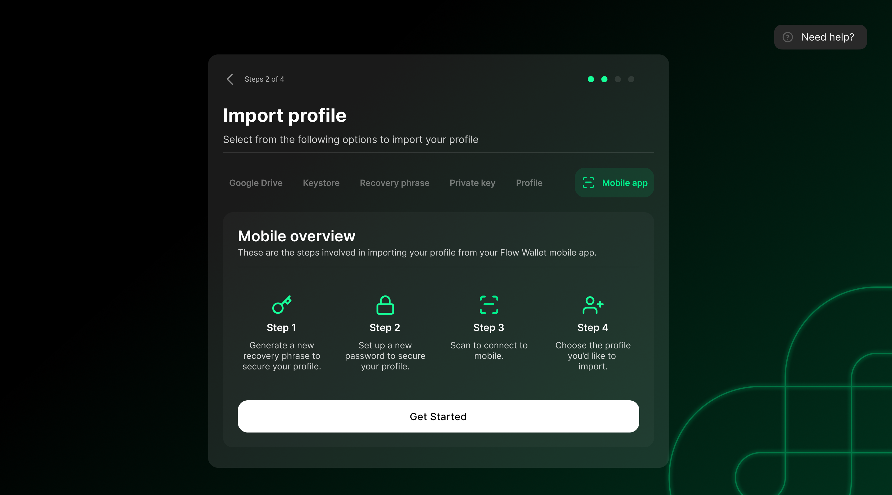
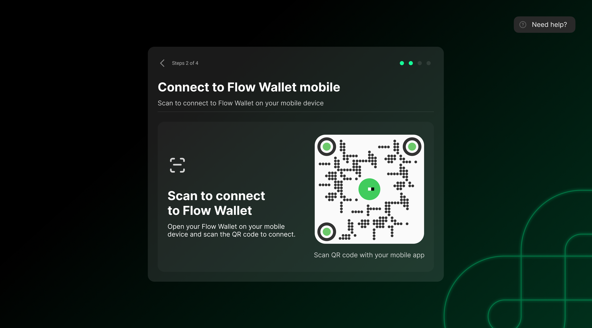
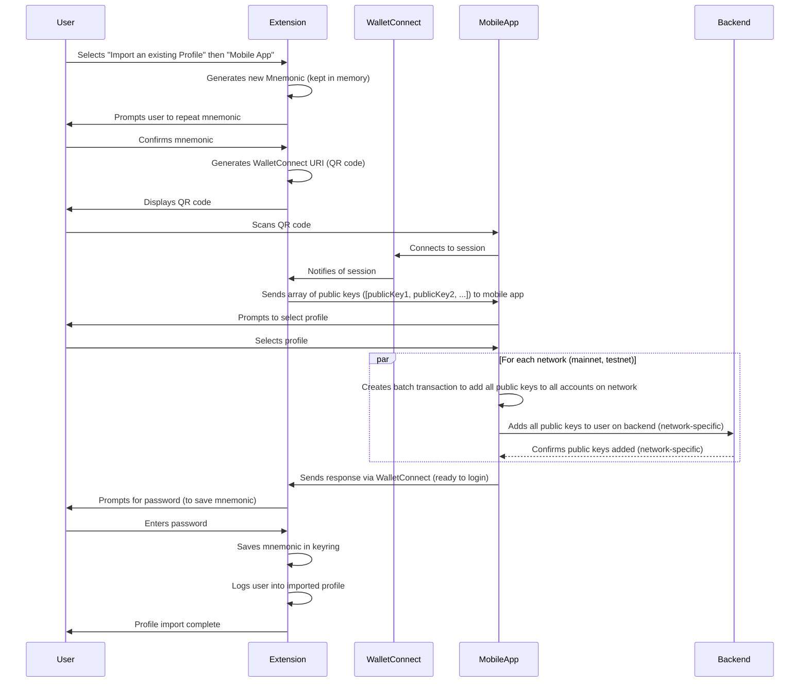
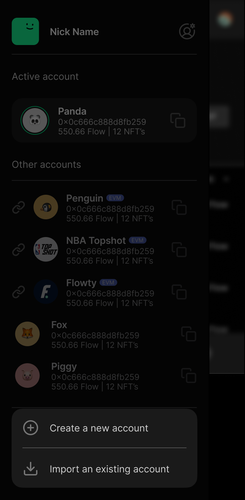
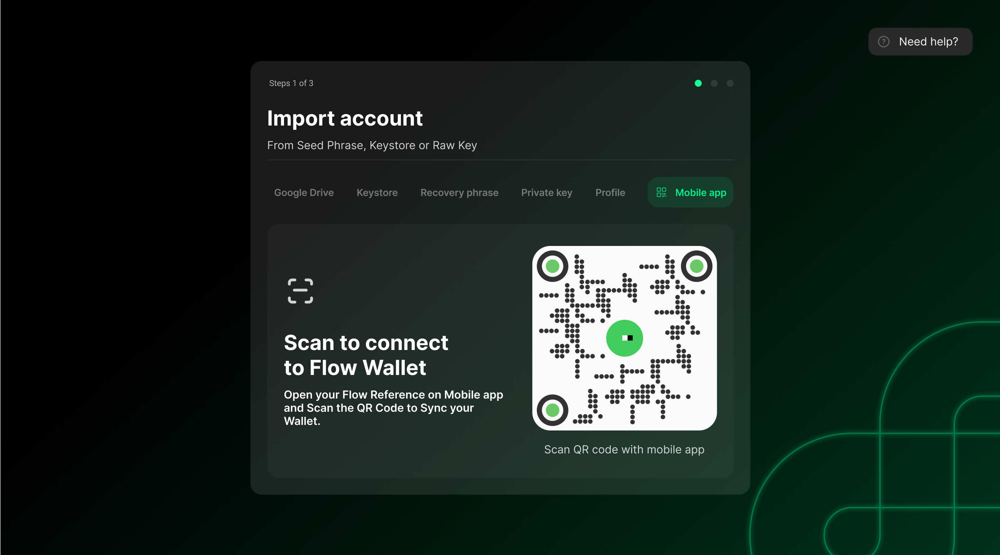
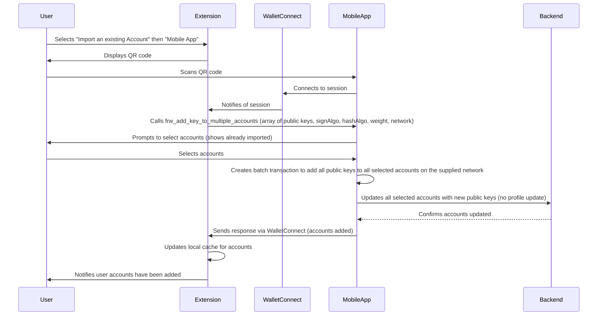

# Import Profile from Mobile

## Overview

The "Import Profile from Mobile" feature allows users to sync their Flow Wallet account from the mobile app to the Chrome extension. This is achieved using WalletConnect, a QR code, and secure transfer of the public key. The process ensures that sensitive data never leaves the user's devices and that we can be sure we are communicating with another wallet.

Profiles are added to the extension by adding a new public key to an existing profile on mobile, including all of its accounts on mainnet and testnet.

---

## User Flow

1. **User selects "Import an existing Profile"** from the extension profile menu then **"Mobile App"**

   

2. **A new Mnemonic is generated**. The user is prompted to repeat it. This is kept in memory until the user confirms the profile to import
3. **A QR code is generated** in the extension, representing a WalletConnect URI.

   

4. **User scans the QR code** with the Flow Wallet mobile app.
5. **WalletConnect session is established** between the extension and the mobile app.
6. **WalletConnect `frw_add_key_to_all_profile_accounts` method called** The extension sends the public key it just created to the mobile app
7. **Mobile prompts the user to select the profile**.

   

8. **Mobile creates a transaction to add the public key** to all of the accounts on both mainnet and testnet of the selected profile. There would be two transactions - one for each network.
9. **Mobile adds the public key to the user on our backend**. This will allow the user to log in on the extension.
10. **Response is sent to the extension via WalletConnect** to let the extension know it can save the mnemonic locally and log in.
11. **User prompted to enter password** This is used to save the new mnemonic in the keyring.
12. **Extension saves the mnemonic in keyring**. Only after the public key is added does the extension save the mnemonic—otherwise, we can be left with an empty profile.
13. **Extension logs the user into the imported profile** using the mnemonic to generate a private key and generate the signature for login.

---

## Sequence Diagram



---

## WalletConnect Message Format

When the extension is ready to add the new key to the selected profile, it should send a WalletConnect message to the mobile app using the following method and data structure:

- **Method:** `frw_add_key_to_all_profile_accounts`
- **Params Example:**

```json
{
  "publicKeys": [
		{
			"publicKey": "<hex-encoded-public-key>",
			"signAlgo": <sign-algorithm-id>,
			"hashAlgo": <hash-algorithm-id>,
			"weight": <weight>
		}
	],
  "deviceInfo": {
    "deviceId": "...",
    "name": "FRW Chrome Extension",
    "userAgent": "Chrome"
    // ...other device/location fields as needed
  }
}
```

- The `publicKey` is the new key generated by the extension and kept in memory until the process is confirmed.
- `signAlgo`, `hashAlgo`, and `weight` are required for Flow key registration.
- `deviceInfo` is optional but can be included for analytics or device management.
- Note generally only one public would be sent as the seed phrase is not yet saved into the extendion, there would be no backup at the point this is called. However this may change in the future.

**References:**

- [FRW-iOS #1369](https://github.com/onflow/FRW-iOS/issues/1369)
- [FRW-Android #1144](https://github.com/onflow/FRW-Android/issues/1144)
- [FRW-Extension #1023](https://github.com/onflow/FRW-Extension/issues/1023)

---

## Technical Details

### Extension (Frontend)

- **Mnemonic Generation:**
  - The extension generates a new mnemonic and prompts the user to confirm it. The mnemonic is kept in memory and not saved until the backend confirms the public key addition.
- **WalletConnect Initialization:**
  - The extension initializes a WalletConnect session and generates a QR code for the user to scan.
- **Session Handling:**
  - On connection, the extension sends the new public key(s) to the mobile app.
- **Mobile Profile Selection:**
  - The mobile app prompts the user to select a profile to which the new public key(s) will be added.
- **Public Key Addition:**
  - The mobile app creates a **batch transaction** per network (mainnet and testnet) to add all provided public keys to all accounts of the selected profile and updates the backend.
- **Confirmation and Finalization:**
  - Once the backend confirms the public keys are added, the mobile app notifies the extension via WalletConnect.
  - The extension then prompts the user for their password, saves the mnemonic in the keyring, and logs the user into the imported profile.

### Mobile App (Backend Coordination)

- **Profile Selection and Transaction:**
  - The mobile app receives the new public key(s) from the extension, prompts the user to select a profile, and creates a **batch transaction** per network to add all keys to all relevant accounts. See issue [FRW-web-next #380](https://github.com/onflow/FRW-web-next/issues/380) and [FRW-web-next #392](https://github.com/onflow/FRW-web-next/issues/392) for details of how to do this.
- **Backend Update:**
  - The mobile app updates the backend to associate the new public keys with the user for each network.
  - Call the `v3/sync` API call
- **Session Confirmation:**
  - The mobile app sends a confirmation response to the extension via WalletConnect, signaling that the extension can now safely prompt for password, save the mnemonic, and log in.

### Security Considerations

- **Mnemonic Handling:**
  - The mnemonic is only saved in the extension after the public key is successfully added to the user's accounts, preventing empty or orphaned profiles.
- **End-to-End Security:**
  - Sensitive data (mnemonic, private key) never leaves the user's devices unencrypted. All communication between extension and mobile is via WalletConnect.
- **User Confirmation:**
  - The user must confirm the mnemonic and select the profile on mobile, ensuring explicit consent for key addition.
- **Password Prompt Timing:**
  - The password is only requested after backend confirmation, ensuring the mnemonic is not persisted prematurely.

---

## Import Multiple Accounts from Mobile

## Overview

In addition to being able to import a whole profile from mobile, the user can import accounts from mobile to an existing profile. This will add the public key of the existing extension profile to the accounts the user selects on either mainnet or testnet.

## User Flow

1. **User selects "Import an existing Account"** from the extension profile menu then **"Mobile App"**

   

2. **A QR code is generated** in the extension, representing a WalletConnect URI.

   

3. **User ensures the correct profile is open then scans the QR code** with the Flow Wallet mobile app.
4. **WalletConnect session is established** between the extension and the mobile app.
5. **WalletConnect `frw_add_key_to_multiple_accounts` method called** The extension sends the public key it just created to the mobile app along with the network, signAlgo, hashAlgo, and weight (which should be 1000).
6. **Mobile prompts the user to select the accounts to import from the current profile**. It should switch to the network used in the event. It should indicate any accounts which already have the given key attached to it as "already imported".

   

7. **Mobile creates a transaction to add public keys** to all of the selected accounts on whichever network the user selected. This will add the primary public key of the profile and any backup keys when the extension supports multi-backup.
8. **Response is sent to the extension via WalletConnect** to let the extension know which accounts were added.
9. **Extension accounts are updated**. The extension can update its cache locally with the account information as the indexer takes time to update. Once the indexer updates it can remove this info from local cache. We do the same thing when adding accounts.
10. **User told the accounts have been added**

---

## Sequence Diagram



---

## WalletConnect Message Format

When the extension is ready to add the public key to selected accounts, it should send a WalletConnect message to the mobile app using the following method and data structure:

- **Method:** `frw_add_key_to_multiple_accounts`
- **Params Example:**

```json
{
	"publicKeys": [
		{
			"publicKey": "<hex-encoded-public-key>",
			"signAlgo": <sign-algorithm-id>,
			"hashAlgo": <hash-algorithm-id>,
			"weight": <weight>
		}
	],
	"network": "mainnet" | "testnet"
}
```

- The `publicKey` is the key from the extension's existing profile.
- `signAlgo`, `hashAlgo`, and `weight` are required for Flow key registration.
- `network` specifies which network's accounts to import (mainnet or testnet).
- There can be multiple public keys if the extension supports multi-backup in the future

**References:**

- [FRW-iOS #1370](https://github.com/onflow/FRW-iOS/issues/1370)
- [FRW-Android #1145](https://github.com/onflow/FRW-Android/issues/1145)
- [FRW-Extension #1021](https://github.com/onflow/FRW-Extension/issues/1021)

---

## Technical Details: Import Multiple Accounts from Mobile

### Extension (Frontend)

- **WalletConnect Initialization:**
  - The extension initializes a WalletConnect session and generates a QR code for the user to scan.
- **Session Handling:**
  - On connection, the extension sends the existing profile's public key(s) to the mobile app, along with the selected network.
- **Mobile Account Selection:**
  - The mobile app prompts the user to select specific accounts to which the public key(s) will be added.
- **Public Key Addition:**
  - The mobile app creates a **batch transaction** to add all provided public keys to all selected accounts on the specified network and updates the backend.
- **Confirmation and Finalization:**
  - Once the backend confirms the public keys are added, the mobile app notifies the extension via WalletConnect.
  - The extension updates its local cache for the imported accounts and notifies the user that the accounts have been added.

### Mobile App (Backend Coordination)

- **Account Selection and Transaction:**
  - The mobile app receives the public key(s) and network from the extension, prompts the user to select accounts, and creates a **batch transaction** to add all keys to all selected accounts on the specified network. See issue [FRW-web-next #380](https://github.com/onflow/FRW-web-next/issues/380) and [FRW-web-next #392](https://github.com/onflow/FRW-web-next/issues/392) for details of how to do this.
- **Backend Update:**
  - The mobile app updates the backend to associate the new public keys with the selected accounts.
  - Call the `v3/sync` API call
- **Session Confirmation:**
  - The mobile app sends a confirmation response to the extension via WalletConnect, signaling that the extension can now update its local cache and notify the user.

---

## Security Considerations: Import Multiple Accounts from Mobile

- **Key Handling:**
  - Only the public key(s) from the existing extension profile are sent; no new mnemonic or private key is generated or transmitted.
- **End-to-End Security:**
  - Sensitive data (private key, mnemonic) never leaves the user's devices unencrypted. All communication between extension and mobile is via WalletConnect.
- **User Confirmation:**
  - The user must explicitly select which accounts to import on the mobile app, ensuring consent for key addition.
- **Cache Consistency:**
  - The extension updates its local cache only after backend confirmation, reducing the risk of inconsistent state.
- **No Password Prompt:**
  - Since no new mnemonic is generated, the user is not prompted for a password during this flow.

---
