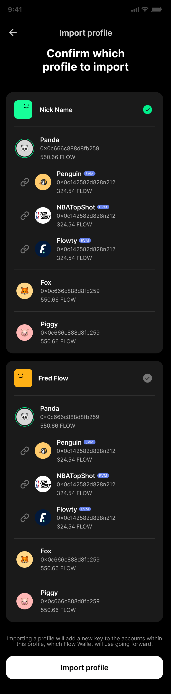
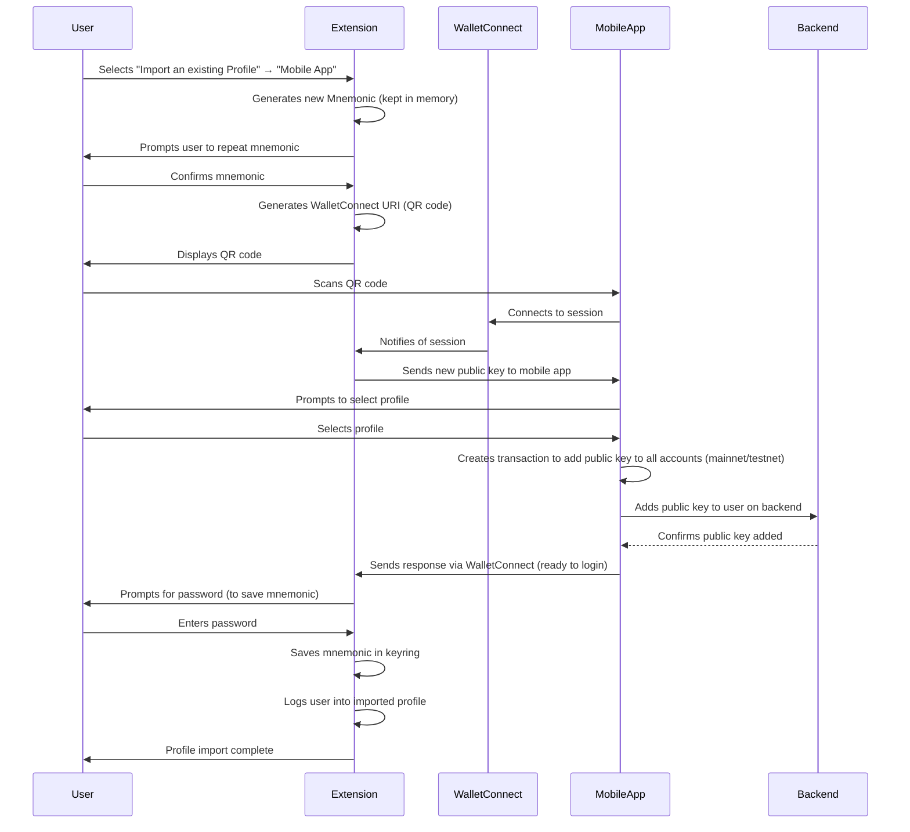

# Import Profile from Mobile

## Overview

The "Import Profile from Mobile" feature allows users to sync their Flow Wallet account from the mobile app to the Chrome extension. This is achieved using WalletConnect, a QR code, and secure transfer of the public key. The process ensures that sensitive data never leaves the user's devices and that we can be sure we are communicating with another wallet.

Profiles are added to the extension by adding a new public key to an existing profile on mobile, including all of its accounts on mainnet and testnet.

---

## User Flow

1. **User selects "Import an existing Profile"** from the extension profile menu then **"Mobile App"**

   

2. **A new Mnemonic is generated**. The user is prompted to repeat it. This is kept in memory until the user confirms the profile to import
3. **A QR code is generated** in the extension, representing a WalletConnect URI.

   

4. **User scans the QR code** with the Flow Wallet mobile app.
5. **WalletConnect session is established** between the extension and the mobile app.
6. **The extension sends the public key it just created to the mobile app**.
7. **Mobile prompts the user to select the profile**.

   

8. **Mobile creates a transaction to add the public key** to all of the accounts on mainnet and testnet of the selected profile.
9. **Mobile adds the public key to the user on our backend**. This will allow the user to log in on the extension.
10. **Response is sent to the extension via WalletConnect** to let the extension know it can save the mnemonic locally and log in.
11. **User prompted to enter password** This is used to save the new mnemonic in the keyring.
12. **Extension saves the mnemonic in keyring**. Only after the public key is added does the extension save the mnemonic—otherwise, we can be left with an empty profile.
13. **Extension logs the user into the imported profile** using the mnemonic to generate a private key and generate the signature for login.

---

## Sequence Diagram



---

## WalletConnect Message Format

When the extension is ready to add the new key to the selected profile, it should send a WalletConnect message to the mobile app using the following method and data structure:

- **Method:** `frw_add_key_to_all_profile_accounts`
- **Params Example:**

```json
{
  "publicKey": "<hex-encoded-public-key>",
  "signAlgo": <sign-algorithm-id>,
  "hashAlgo": <hash-algorithm-id>,
  "weight": <key-weight>,
  "deviceInfo": {
    "deviceId": "...",
    "name": "FRW Chrome Extension",
    "userAgent": "Chrome"
    // ...other device/location fields as needed
  }
}
```

- The `publicKey` is the new key generated by the extension and kept in memory until the process is confirmed.
- `signAlgo`, `hashAlgo`, and `weight` are required for Flow key registration.
- `deviceInfo` is optional but can be included for analytics or device management.

**References:**

- [FRW-iOS #1369](https://github.com/onflow/FRW-iOS/issues/1369)
- [FRW-Extension #1023](https://github.com/onflow/FRW-Extension/issues/1023)

---

## Technical Details

### Extension (Frontend)

- **Mnemonic Generation:**
  - The extension generates a new mnemonic and prompts the user to confirm it. The mnemonic is kept in memory and not saved until the backend confirms the public key addition.
- **WalletConnect Initialization:**
  - The extension initializes a WalletConnect session and generates a QR code for the user to scan.
- **Session Handling:**
  - On connection, the extension sends the new public key to the mobile app.
- **Mobile Profile Selection:**
  - The mobile app prompts the user to select a profile to which the new public key will be added.
- **Public Key Addition:**
  - The mobile app creates a transaction to add the public key to all accounts (mainnet and testnet) of the selected profile and updates the backend.
- **Confirmation and Finalization:**
  - Once the backend confirms the public key is added, the mobile app notifies the extension via WalletConnect.
  - The extension then prompts the user for their password, saves the mnemonic in the keyring, and logs the user into the imported profile.

### Mobile App (Backend Coordination)

- **Profile Selection and Transaction:**
  - The mobile app receives the new public key from the extension, prompts the user to select a profile, and creates a transaction to add the key to all relevant accounts.
- **Backend Update:**
  - The mobile app updates the backend to associate the new public key with the user.
- **Session Confirmation:**
  - The mobile app sends a confirmation response to the extension via WalletConnect, signaling that the extension can now safely prompt for password, save the mnemonic, and log in.

---

## Security Considerations

- **Mnemonic Handling:**
  - The mnemonic is only saved in the extension after the public key is successfully added to the user's accounts, preventing empty or orphaned profiles.
- **End-to-End Security:**
  - Sensitive data (mnemonic, private key) never leaves the user's devices unencrypted. All communication between extension and mobile is via WalletConnect.
- **User Confirmation:**
  - The user must confirm the mnemonic and select the profile on mobile, ensuring explicit consent for key addition.
- **Password Prompt Timing:**
  - The password is only requested after backend confirmation, ensuring the mnemonic is not persisted prematurely.

---

## User Experience

- The process is designed to be seamless: confirm mnemonic, scan QR, approve on mobile, enter password, and you're done.
- All sensitive operations (like handling the mnemonic) are performed locally and only finalized after backend confirmation.
