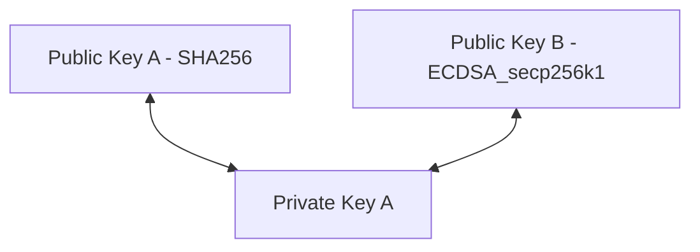
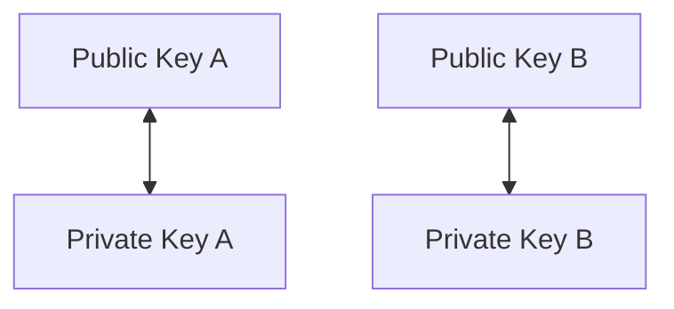
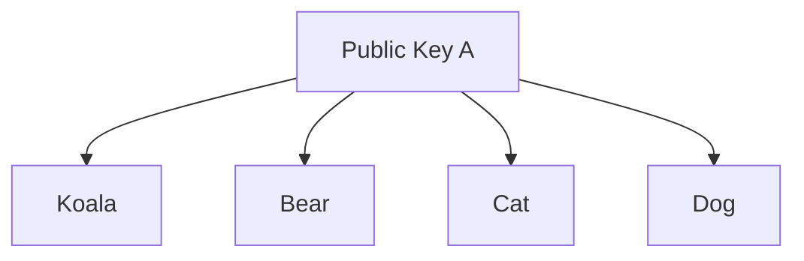
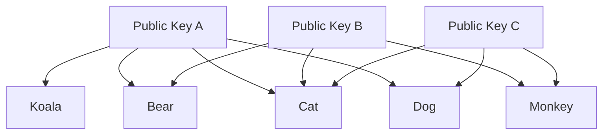
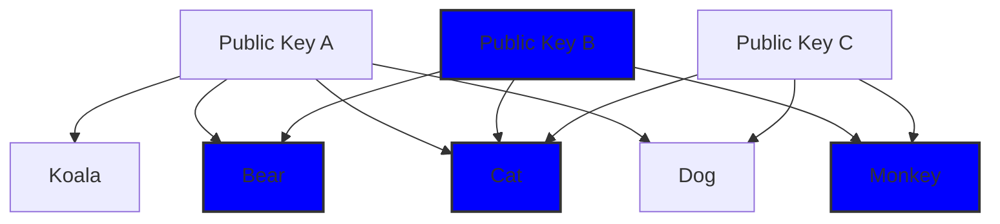
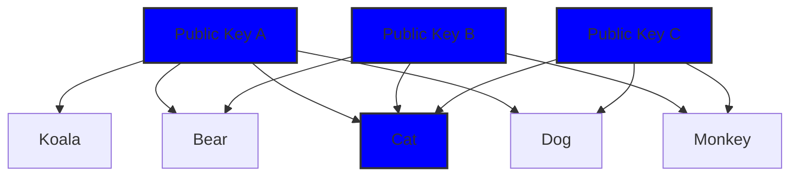
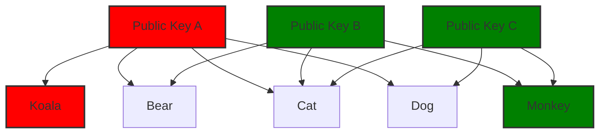
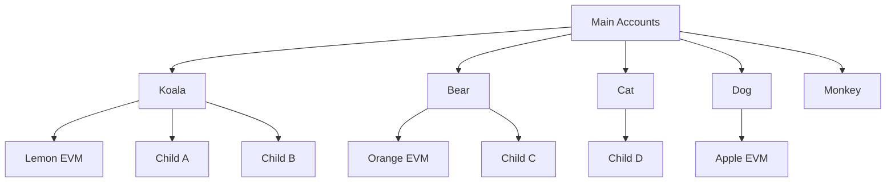

# Wallet Account Structure

## Private Keys

At it’s heart this is what a Wallet stores - private keys. A private key without a public key is just bytes. It might need to have a certain length / contain certain characters to be used but it’s meaningless without a public key.

A cryptographic algorithm is used to generate public keys from private keys. This way it is _possible_ to have multiple public keys against a private key depending on the algorithm used to generate it.

We support multiple algorithms in the Wallet, but generally a single profile in a wallet has one public key associated with it.

When you login to a wallet, you are “unlocking” a set of private keys.

You can import a private key and export one - but there is no way to access a private key through any network operation. It is stored locally in the wallet and should never - ever - be transmitted across the network.

This means wallets can only ever interact with things associated to the public key that is paired with a private key it stores.

<aside>
💡 A wallet has access to the accounts that have public keys associated with the **private keys it stores**

</aside>

## Public Keys

A public key can be associated with 1 or more Accounts on Flow. As specified earlier the algorithm used to generate the public key is also registered on the account. We refer to these accounts in the wallet as “Main Accounts”. These are accounts that run natively with Cadence on the Flow network.

Each Account can have 1 or more public keys

If you logged in with Public Key B, then you would get access to Bear, Cat, and Monkey accounts

There is no “default” or “root” account associated with a public key - every main account has the same capabilities in Flow Wallet. When you login though, we take the user to the first account created.

## Main Accounts

An account on the Cadence network (Main Account) has the following properties:

- **Address**: unique identifier for the account
- **Public Keys**: public keys authorised on the account
- **Code**: Cadence contracts deployed to the account
- **Storage**: area of the account used to store resource assets.
- **Nickname (wallet only)**: These are automatically assigned. All Main accounts have animal names. EVM accounts are all fruit names. These make the wallet easier to navigate.
- **Emoji (wallet only)**: This is again automatically assigned based on the nickname.

You might notice from the above, not only is it possible to have more than one account against a public key, it is possible for more than one public key to be associated with an account. It’s a many to many relationship

<aside>
💡 Just because a wallet has access to an account, does not mean it has access to _every_ public-private key associated with it.

</aside>

For example, a wallet might have have access to all the accounts associated with public key A - Koala, Bear, Cat, and Dog - because it stores private key A. But that does not mean it has access to the private key associated with public key B or C. That means it cannot access the Monkey account.

## Child & EVM Accounts

Each “Main Account” can have child accounts. A Main account could have a child EVM account to interact with the Ethereum network or a Child dapper account (using Cadence). When a new account is created in Flow Wallet, we _always_ create a single EVM account with it. It is possible though to import an account that has no EVM account. Other child accounts - like Dapper accounts - are linked to a Main Account through dApps.

## Storage & Fees

Note that only the Main account has storage. Storage allows the storage of assets and requires Flow balance. Operations on child or evm accounts do not affect storage - even if using Flow token.

However, fees always come from the main account if performing an operation on a child or evm account.

<aside>
💡 An operation on a child / evm account can affect the storage on the main account.

</aside>

## Profiles

A user can setup multiple profiles in flow wallet. A profile has:

- A nickname - whatever the user sets when they register
- A globally unique username - the nickname with a number at the end
- A **single** private key associated with it

There is no linkage between profiles.

Currently, creating or importing a new account in flow wallet creates a new profile. If you try to import a public/private Keypair that already exists in a profile, then you will simply be logged into that existing profile - it will not allow you to import the same public/private key-pair twice.

<aside>
💡 The wallet supports **one private key per profile.**

</aside>

## Password

It is only possible to have one password in Flow Wallet. This is used to access all profiles.

## Public Key Weights

The Flow chain is designed to support multiple signers. However, we don’t yet support this in the wallet. This works using a signing weight.

1. Signing a transaction requires the total weight to be over 1000, if the key is lower, it requires an additional co-signer to sign the transaction. For example, It it is possibly to have 2 keys required to sign a transaction both with 500 weight. All sorts of signing combinations could be possible with these weights.
2. Only public key that weight is above or equal to 1000 are allowed to sign in to the extension
3. Register or importing from extension set the weight as 1000 in default

## Mainnet and Testnet

Mainnet and Testnet are two completely separate networks. Only mainnet assets have value. Accounts that exist on Mainnet do not exist on Testnet and vice versa - however they may share public keys.

This is currently how the wallet switches beween mainnet and testnet - the Wallet looks for accounts with the same public keys on each network.

The connection to the Flow blockchain `fcl`(Flow Client Library) must be initialised with either the mainnet or testnet endpoint. Anything that is addressed is network specific.
