# Core Package Dependency Diagram

## Overview

This diagram shows the dependencies between services and utilities in the `@onflow/flow-wallet-core` package.
Generated on: 2025-07-18T23:59:42.450Z

## Statistics

- Total modules: 47
  - Services: 27
  - Utilities: 20
- Modules with no dependencies: 16
- Circular dependencies found: 2

## Mermaid Dependency Graph

```mermaid
graph TD
    %% Style definitions
    classDef circular fill:#ff6b6b,stroke:#c92a2a,stroke-width:3px,color:#fff
    classDef nodeps fill:#51cf66,stroke:#37b24d,stroke-width:2px
    classDef hub fill:#339af0,stroke:#1864ab,stroke-width:3px,color:#fff
    classDef normal fill:#868e96,stroke:#495057,stroke-width:2px,color:#fff
    classDef util fill:#fab005,stroke:#f59f00,stroke-width:2px

    %% Module nodes
    service_account_management["account-management"]:::hub
    service_addressBook["addressBook"]:::normal
    service_authentication_service["authentication-service"]:::normal
    service_coinList["coinList"]:::normal
    service_googleDrive["googleDrive"]:::nodeps
    service_googleSafeHost["googleSafeHost"]:::normal
    service_keyring_display["keyring/display"]:::normal
    service_keyring_hdKeyring["keyring/hdKeyring"]:::nodeps
    service_keyring_simpleKeyring["keyring/simpleKeyring"]:::nodeps
    service_log_listener["log-listener"]:::normal
    service_mixpanel["mixpanel"]:::hub
    service_news["news"]:::normal
    service_nft_evm["nft-evm"]:::normal
    service_nft["nft"]:::normal
    service_openapi["openapi"]:::circular
    service_permission["permission"]:::normal
    service_preference["preference"]:::normal
    service_remoteConfig["remoteConfig"]:::circular
    service_session["session"]:::normal
    service_signTextHistory["signTextHistory"]:::normal
    service_storage_management["storage-management"]:::hub
    service_token_list["token-list"]:::normal
    service_transaction_activity["transaction-activity"]:::normal
    service_transactions["transactions"]:::normal
    service_user["user"]:::normal
    service_userWallet["userWallet"]:::circular
    service_version_service["version-service"]:::nodeps
    utils_account_key["account-key"]:::util
    utils_fclConfig["fclConfig"]:::nodeps
    utils_getLoggedInAccount["getLoggedInAccount"]:::nodeps
    utils_key_indexer["key-indexer"]:::nodeps
    utils_modules_CborSimpleDecoder["modules/CborSimpleDecoder"]:::nodeps
    utils_modules_Crypto["modules/Crypto"]:::circular
    utils_modules_Signature["modules/Signature"]:::util
    utils_modules_WebAuthnDecoder["modules/WebAuthnDecoder"]:::circular
    utils_modules_WebAuthnTypes["modules/WebAuthnTypes"]:::nodeps
    utils_modules_base64["modules/base64"]:::circular
    utils_modules_findAddressWithPK["modules/findAddressWithPK"]:::nodeps
    utils_modules_findAddressWithPubKey["modules/findAddressWithPubKey"]:::nodeps
    utils_modules_passkey["modules/passkey"]:::util
    utils_modules_publicPrivateKey["modules/publicPrivateKey"]:::nodeps
    utils_modules_settings["modules/settings"]:::util
    utils_modules_utils["modules/utils"]:::util
    utils_persistStore["persistStore"]:::nodeps
    utils_promiseFlow["promiseFlow"]:::nodeps
    utils_random_id["random-id"]:::nodeps
    utils_sessionStore["sessionStore"]:::nodeps

    %% Dependencies
    service_account_management --> service_googleDrive
    service_account_management --> service_mixpanel
    service_account_management --> service_openapi
    service_account_management --> service_user
    service_account_management --> utils_account_key
    service_account_management --> utils_key_indexer
    service_account_management --> utils_modules_publicPrivateKey
    service_account_management --> utils_random_id
    service_addressBook --> utils_persistStore
    service_authentication_service --> service_mixpanel
    service_coinList --> service_openapi
    service_googleSafeHost --> utils_persistStore
    service_keyring_display --> service_keyring
    service_log_listener --> service_mixpanel
    service_mixpanel --> service_version_service
    service_news --> service_openapi
    service_news --> utils_persistStore
    service_nft_evm --> utils_fclConfig
    service_nft --> utils_fclConfig
    service_openapi --> service_index
    service_openapi --> service_googleSafeHost
    service_openapi --> service_mixpanel
    service_openapi --> service_userWallet
    service_openapi --> service_authentication_service
    service_openapi --> service_version_service
    service_openapi --> utils_modules_publicPrivateKey
    service_permission --> utils_persistStore
    service_preference --> utils_persistStore
    service_remoteConfig --> service_openapi
    service_session --> service_permission
    service_signTextHistory --> utils_persistStore
    service_storage_management --> service_addressBook
    service_storage_management --> service_coinList
    service_storage_management --> service_nft
    service_storage_management --> service_transaction_activity
    service_storage_management --> service_user
    service_storage_management --> service_userWallet
    service_token_list --> service_openapi
    service_transaction_activity --> service_preference
    service_transactions --> service_mixpanel
    service_transactions --> service_openapi
    service_transactions --> service_userWallet
    service_user --> service_openapi
    service_user --> utils_persistStore
    service_userWallet --> service_keyring
    service_userWallet --> service_mixpanel
    service_userWallet --> service_preference
    service_userWallet --> service_remoteConfig
    service_userWallet --> service_transaction_activity
    service_userWallet --> utils_account_key
    service_userWallet --> utils_fclConfig
    service_userWallet --> utils_key_indexer
    service_userWallet --> utils_modules_publicPrivateKey
    service_userWallet --> utils_persistStore
    utils_account_key --> utils_modules_publicPrivateKey
    utils_modules_Crypto --> utils_modules_base64
    utils_modules_Signature --> utils_modules_Crypto
    utils_modules_Signature --> utils_modules_WebAuthnDecoder
    utils_modules_WebAuthnDecoder --> utils_modules_CborSimpleDecoder
    utils_modules_WebAuthnDecoder --> utils_modules_Crypto
    utils_modules_WebAuthnDecoder --> utils_modules_WebAuthnTypes
    utils_modules_base64 --> utils_modules_WebAuthnDecoder
    utils_modules_passkey --> utils_modules_base64
    utils_modules_passkey --> utils_modules_settings
    utils_modules_passkey --> utils_modules_WebAuthnDecoder
    utils_modules_settings --> utils_modules_utils
    utils_modules_utils --> utils_modules_base64

    %% Legend
    subgraph Legend
        L1[No Dependencies]:::nodeps
        L2[Circular Dependency]:::circular
        L3[Hub - Many Dependencies]:::hub
        L4[Normal Service]:::normal
        L5[Utility Module]:::util
    end
```

## Key Findings

### 1. Circular Dependencies (Critical Issues)

- **service/openapi ↔ service/userWallet ↔ service/remoteConfig ↔ service/openapi**
- **utils/modules/Crypto ↔ utils/modules/base64 ↔ utils/modules/WebAuthnDecoder ↔ utils/modules/Crypto**

### 2. Hub Modules (High Coupling)

- **service/userWallet**: 10 outgoing dependencies
- **service/account-management**: 8 outgoing dependencies
- **service/openapi**: 7 outgoing dependencies
- **service/storage-management**: 6 outgoing dependencies

### 3. Most Depended Upon Modules

- **utils/persistStore**: 8 modules depend on it
- **service/openapi**: 7 modules depend on it
- **service/mixpanel**: 6 modules depend on it

### 4. Independent Modules (No Dependencies)

**Services:**

- service/googleDrive
- service/keyring/hdKeyring
- service/keyring/simpleKeyring
- service/version-service

**Utilities:**

- utils/fclConfig
- utils/getLoggedInAccount
- utils/key-indexer
- utils/modules/CborSimpleDecoder
- utils/modules/WebAuthnTypes
- utils/modules/findAddressWithPK
- utils/modules/findAddressWithPubKey
- utils/modules/publicPrivateKey
- utils/persistStore
- utils/promiseFlow
- utils/random-id
- utils/sessionStore

## Module Details

### Services

| Service                | Imports                                                                                                                                        | Imported By                                                                                 |
| ---------------------- | ---------------------------------------------------------------------------------------------------------------------------------------------- | ------------------------------------------------------------------------------------------- |
| account-management     | googleDrive, mixpanel, openapi, user, account-key, key-indexer, modules/publicPrivateKey, random-id                                            | _none_                                                                                      |
| addressBook            | persistStore                                                                                                                                   | storage-management                                                                          |
| authentication-service | mixpanel                                                                                                                                       | openapi                                                                                     |
| coinList               | openapi                                                                                                                                        | storage-management                                                                          |
| googleDrive            | _none_                                                                                                                                         | account-management                                                                          |
| googleSafeHost         | persistStore                                                                                                                                   | openapi                                                                                     |
| keyring/display        | keyring                                                                                                                                        | _none_                                                                                      |
| keyring/hdKeyring      | _none_                                                                                                                                         | _none_                                                                                      |
| keyring/simpleKeyring  | _none_                                                                                                                                         | _none_                                                                                      |
| log-listener           | mixpanel                                                                                                                                       | _none_                                                                                      |
| mixpanel               | version-service                                                                                                                                | account-management, authentication-service, log-listener, openapi, transactions, userWallet |
| news                   | openapi, persistStore                                                                                                                          | _none_                                                                                      |
| nft-evm                | fclConfig                                                                                                                                      | _none_                                                                                      |
| nft                    | fclConfig                                                                                                                                      | storage-management                                                                          |
| openapi                | index, googleSafeHost, mixpanel, userWallet, authentication-service, version-service, modules/publicPrivateKey                                 | account-management, coinList, news, remoteConfig, token-list, transactions, user            |
| permission             | persistStore                                                                                                                                   | session                                                                                     |
| preference             | persistStore                                                                                                                                   | transaction-activity, userWallet                                                            |
| remoteConfig           | openapi                                                                                                                                        | userWallet                                                                                  |
| session                | permission                                                                                                                                     | _none_                                                                                      |
| signTextHistory        | persistStore                                                                                                                                   | _none_                                                                                      |
| storage-management     | addressBook, coinList, nft, transaction-activity, user, userWallet                                                                             | _none_                                                                                      |
| token-list             | openapi                                                                                                                                        | _none_                                                                                      |
| transaction-activity   | preference                                                                                                                                     | storage-management, userWallet                                                              |
| transactions           | mixpanel, openapi, userWallet                                                                                                                  | _none_                                                                                      |
| user                   | openapi, persistStore                                                                                                                          | account-management, storage-management                                                      |
| userWallet             | keyring, mixpanel, preference, remoteConfig, transaction-activity, account-key, fclConfig, key-indexer, modules/publicPrivateKey, persistStore | openapi, storage-management, transactions                                                   |
| version-service        | _none_                                                                                                                                         | mixpanel, openapi                                                                           |

### Utilities

| Utility                       | Imports                                                          | Imported By                                                                                  |
| ----------------------------- | ---------------------------------------------------------------- | -------------------------------------------------------------------------------------------- |
| account-key                   | modules/publicPrivateKey                                         | account-management, userWallet                                                               |
| fclConfig                     | _none_                                                           | nft-evm, nft, userWallet                                                                     |
| getLoggedInAccount            | _none_                                                           | _none_                                                                                       |
| key-indexer                   | _none_                                                           | account-management, userWallet                                                               |
| modules/CborSimpleDecoder     | _none_                                                           | modules/WebAuthnDecoder                                                                      |
| modules/Crypto                | modules/base64                                                   | modules/Signature, modules/WebAuthnDecoder                                                   |
| modules/Signature             | modules/Crypto, modules/WebAuthnDecoder                          | _none_                                                                                       |
| modules/WebAuthnDecoder       | modules/CborSimpleDecoder, modules/Crypto, modules/WebAuthnTypes | modules/Signature, modules/base64, modules/passkey                                           |
| modules/WebAuthnTypes         | _none_                                                           | modules/WebAuthnDecoder                                                                      |
| modules/base64                | modules/WebAuthnDecoder                                          | modules/Crypto, modules/passkey, modules/utils                                               |
| modules/findAddressWithPK     | _none_                                                           | _none_                                                                                       |
| modules/findAddressWithPubKey | _none_                                                           | _none_                                                                                       |
| modules/passkey               | modules/base64, modules/settings, modules/WebAuthnDecoder        | _none_                                                                                       |
| modules/publicPrivateKey      | _none_                                                           | account-management, openapi, userWallet, account-key                                         |
| modules/settings              | modules/utils                                                    | modules/passkey                                                                              |
| modules/utils                 | modules/base64                                                   | modules/settings                                                                             |
| persistStore                  | _none_                                                           | addressBook, googleSafeHost, news, permission, preference, signTextHistory, user, userWallet |
| promiseFlow                   | _none_                                                           | _none_                                                                                       |
| random-id                     | _none_                                                           | account-management                                                                           |
| sessionStore                  | _none_                                                           | _none_                                                                                       |
